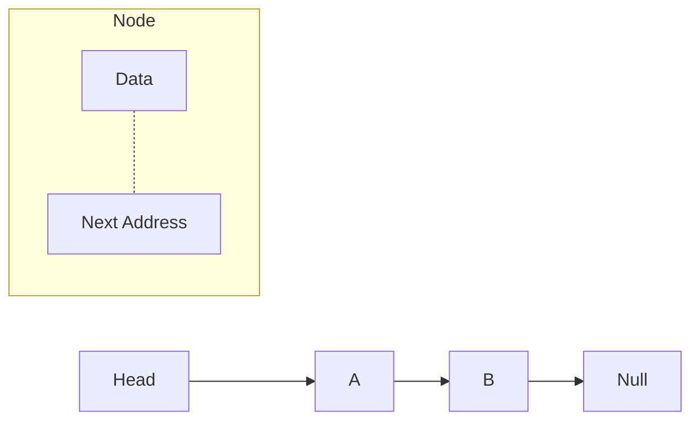
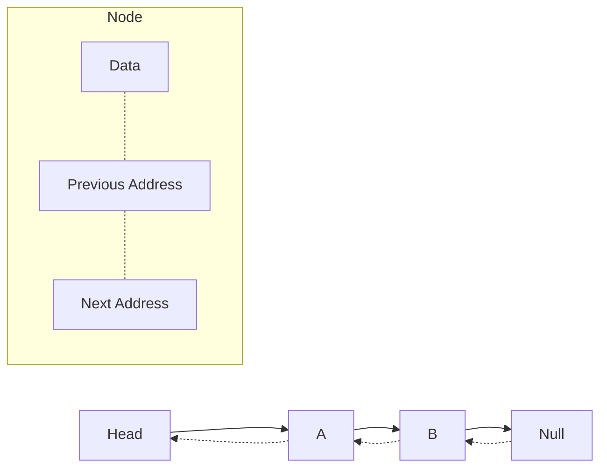
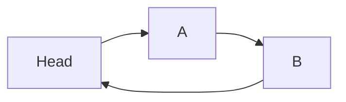

# 🔗 Linked List

> [!info] Navigation: [[CSTU40]] > [[Year 2]] > [[Year 2 Semester 1]] > [[CS213]] > [[Linked List]]
> **Related Notes:** [[CS213]] | [[Memory]] | [[Introduction to Data Structure]] | [[Searching]]
> **Course Labs:** `Labs/Week5/linked_list/`

---

Similar to array, but there is an object and memory allocate is dynamic.

## Singly Linked List
<small>The simplest linked list</small>



For each node there will have a small partition that store an address of next node.
The last node always point to null (in null node there will not have address partition)

Head is the first node of linked list that only store an address of the second node.

```cpp
typedef struct Node {
    int value;
    struct Node* next;
} Node;

Node* addNodeToTail(Node* head, int value) {
    Node* temp = (Node*)malloc(sizeof *temp);
    temp->value = value;
    temp->next = NULL;
    
    if (!head) {
        head = temp;
    } else {
        Node* p = head;
        while (p->next) {
            p = p->next;
        }
        p->next = temp;
    }
    return head;
}
```
<small>Here is simple cpp code to describe for each node</small>

`a[next] --> b[data]`

### Singly Linked List Implementation

```cpp
#include <iostream>
using namespace std;

class Node {
	public:
	  int data;
	  Node *next;
	
	  Node(int data) {
	    this->data = data;
	    this->next = nullptr;
	  }
};

void printList(Node *n) {
  while (n != nullptr) {
    cout << n->data << " ";
    n = n->next;
  }
}

int main() {
  Node *head = new Node(1);
  Node *second = new Node(2);
  Node *third = new Node(3);

  head->next = second;
  second->next = third;

  printList(head);

  return 0;
}
```

---

## Doubly Linked List



While Singly Linked List only oneway relative, the Doubly Linked List has another value that store the previous Node's address.

```cpp
#include <iostream>
using namespace std;

class Node {
	public:
	  int data;
	  Node *prev;
	  Node *next;
	
	  Node(int data) {
	    this->data = data;
	    this->prev = nullptr;
	    this->next = nullptr;
	  }
};

void printList(Node *node) {
  while (node != nullptr) {
    cout << node->data << " ";
    node = node->next;
  }
}

int main() {
  Node *head = new Node(1);
  Node *second = new Node(2);
  Node *third = new Node(3);

  head->next = second;
  second->prev = head;
  second->next = third;
  third->prev = second;

  printList(head);

  return 0;
}
```

---

## Circular Linked List



This is same like Singly Linked List but instead of the last node point to null, it point to it's head instead.

```cpp
#include <iostream>
using namespace std;

class Node {
public:
  int data;
  Node *next;

  Node(int data) {
    this->data = data;
    this->next = nullptr;
  }
};

void printList(Node *head) {
  Node *temp = head;

  if (head != nullptr) {
    do {
      cout << temp->data << " ";
      temp = temp->next;
    } while (temp != head);
  }
}

int main() {
  Node *head = new Node(1);
  Node *second = new Node(2);
  Node *third = new Node(3);

  head->next = second;
  second->next = third;
  third->next = head;

  printList(head);

  return 0;
}
```

---

## Linked list Operations

When manipulating linked lists in-place, care must be taken to not use values that have been invalidated in previous assignments. This makes algorithms for inserting or deleting linked list nodes somewhat subtle.

```pseudo
function insertAfter(Node node, Node newNode)
    newNode.next := node.next
    node.next    := newNode
```

```pseudo
function removeAfter(Node node)
    obsoleteNode := node.next
    node.next := node.next.next
    destroy obsoleteNode
```
