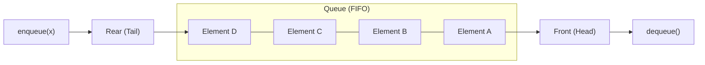

# 🚶‍♂️ Queue ADT & Implementations

> [!info] Navigation: [[CSTU40]] > [[Year 2]] > [[Year 2 Semester 1]] > [[CS213]] > [[Queue]]
> **Related Notes:** [[CS213]] | [[Linked List]] | [[Stack]] | [[Memory]]

---

## 1. Queue Conceptual Overview

A **Queue** is a linear data structure (Abstract Data Type) operating under the **First In, First Out (FIFO)** principle. Elements are inserted at one end, known as the **rear** (or tail), and removed from the opposite end, known as the **front** (or head).



- **FIFO (First In, First Out):** The first element inserted into the queue is the first one to be removed.
- **Key Operations:**
  - `Enqueue(x)`: Inserts element $x$ at the rear of the queue.
  - `Dequeue()`: Removes and returns the element at the front of the queue.
  - `IsEmpty()`: Checks whether the queue contains zero elements.
  - `IsFull()`: Checks whether the queue has reached capacity (applicable to static arrays).

---

## 2. Array-Based Implementation (`Circular Array Queue`)

### The Need for a Circular Array
1. **Naïve Array Queue:** If `front` stays at index `0` and elements are shifted forward on each dequeue, `Dequeue()` costs $\mathcal{O}(n)$ time.
2. **Linear Shifting Pointers:** If `front` moves backward on each dequeue without shifting elements, `rear` quickly reaches the end of the array even if spaces are freed up at the front (*false overflow*).
3. **Circular Array Solution:** The array wraps around using modular arithmetic (`% maxSize`), allowing elements to reuse freed front slots in $\mathcal{O}(1)$ time. A `counter` variable tracks the current number of elements to distinguish between an empty queue and a full queue.

---

### Class Definition

```cpp
class Queue {
public:
    Queue(int size = 10);              // Constructor
    ~Queue() { delete [] values; }     // Destructor
    
    int IsEmpty(void);                 // Check if queue is empty
    int IsFull(void);                  // Check if queue is full
    void Enqueue(double x);            // Add element to rear
    void Dequeue(double & x);          // Remove element from front
    void DisplayQueue(void);           // Print elements from front to rear

private:
    int front;                         // Index of front element
    int rear;                          // Index of rear element
    int counter;                       // Current number of elements stored
    int maxSize;                       // Maximum capacity of the array
    double* values;                    // Pointer to dynamically allocated array
};
```

---

### Function Breakdown & Code Explanations

#### A. Constructor `Queue::Queue(int size)`
- **Description:** Dynamically allocates memory for an array of doubles of size `size`. Initializes `maxSize = size`, `front = 0`, `rear = -1`, and `counter = 0`.
- **Time Complexity:** $\mathcal{O}(1)$

```cpp
Queue::Queue(int size /* = 10 */) {
    values = new double[size];
    maxSize = size;
    front = 0;       // Points to the first slot
    rear = -1;       // -1 indicates that no element has been enqueued yet
    counter = 0;     // Initially zero elements
}
```

#### B. Destructor `Queue::~Queue()`
- **Description:** Releases the dynamically allocated memory buffer `values` with `delete []`.
- **Time Complexity:** $\mathcal{O}(1)$

```cpp
Queue::~Queue() {
    delete [] values;
}
```

#### C. `int Queue::IsEmpty()`
- **Description:** Returns `1` (true) if `counter == 0`, meaning there are no elements currently in the queue; otherwise returns `0` (false).
- **Time Complexity:** $\mathcal{O}(1)$

```cpp
int Queue::IsEmpty() {
    return counter == 0;
}
```

#### D. `int Queue::IsFull()`
- **Description:** Returns `1` (true) if `counter >= maxSize`, meaning all slots in the circular array are occupied; otherwise returns `0` (false).
- **Time Complexity:** $\mathcal{O}(1)$

```cpp
int Queue::IsFull() {
    return counter >= maxSize;
}
```

#### E. `void Queue::Enqueue(double x)`
- **Description:** Adds element $x$ to the rear of the queue. First checks whether the queue is full using `IsFull()`. If full, prints an error message. Otherwise:
  1. Computes the new circular rear index: `rear = (rear + 1) % maxSize`.
  2. Stores $x$ into `values[rear]`.
  3. Increments `counter++`.
- **Time Complexity:** $\mathcal{O}(1)$

```cpp
void Queue::Enqueue(double x) {
    if (IsFull()) {
        cout << "Error: the queue is full." << endl;
    } else {
        // Calculate new rear position with circular wrap-around
        rear = (rear + 1) % maxSize;
        values[rear] = x;
        counter++;
    }
}
```

#### F. `void Queue::Dequeue(double & x)`
- **Description:** Removes the front element and returns it through the reference parameter `x`. First checks whether the queue is empty using `IsEmpty()`. If empty, prints an error message. Otherwise:
  1. Retrieves the front value: `x = values[front]`.
  2. Advances `front` circularly: `front = (front + 1) % maxSize`.
  3. Decrements `counter--`.
- **Time Complexity:** $\mathcal{O}(1)$

```cpp
void Queue::Dequeue(double & x) {
    if (IsEmpty()) {
        cout << "Error: the queue is empty." << endl;
    } else {
        // Retrieve the front item
        x = values[front];
        // Move front index circularly
        front = (front + 1) % maxSize;
        counter--;
    }
}
```

#### G. `void Queue::DisplayQueue()`
- **Description:** Iterates over the queue $counter$ times starting from index `front`, accessing elements using `(front + i) % maxSize` to correctly handle the circular wrap-around.
- **Time Complexity:** $\mathcal{O}(n)$

```cpp
void Queue::DisplayQueue() {
    cout << "front -->";
    for (int i = 0; i < counter; i++) {
        if (i == 0) cout << "	";
        else cout << "		";
        
        cout << values[(front + i) % maxSize];
        
        if (i != counter - 1)
            cout << endl;
        else
            cout << "	<-- rear" << endl;
    }
}
```

---

## 3. Linked List-Based Implementation (`Queue`)

In a linked list queue, nodes are dynamically allocated. `front` points to the first node (where dequeue occurs) and `rear` points to the last node (where enqueue occurs). The queue never overflows as long as heap memory is available.

### Class Definition

```cpp
class Queue {
public:
    Queue();                           // Constructor
    ~Queue();                          // Destructor (frees remaining nodes)
    
    int IsEmpty() { return counter == 0; }
    void Enqueue(double x);            // Add to tail (rear)
    void Dequeue(double & x);          // Remove from head (front)
    void DisplayQueue(void);           // Print elements from front to rear

protected:
    struct Node {
        double data;
        Node* next;
        Node(double x) { data = x; next = NULL; }
    };
    Node* front;                       // Pointer to front node (head)
    Node* rear;                        // Pointer to rear node (tail)
    int counter;                       // Number of elements
};
```

---

### Function Breakdown & Code Explanations

#### A. Constructor `Queue::Queue()` & Destructor `Queue::~Queue()`
- **Description:** 
  - The constructor sets `front = rear = NULL` and `counter = 0`.
  - The destructor empties the queue by repeatedly calling `Dequeue()` until `IsEmpty()` is true, freeing all dynamically allocated nodes.
- **Time Complexity:** Constructor $\mathcal{O}(1)$, Destructor $\mathcal{O}(n)$

```cpp
Queue::Queue() {
    front = rear = NULL;
    counter = 0;
}

Queue::~Queue() {
    double value;
    while (!IsEmpty()) {
        Dequeue(value);
    }
}
```

#### B. `void Queue::Enqueue(double x)`
- **Description:** Appends a new node with data `x` to the rear of the queue.
  - If the queue was empty, both `front` and `rear` point to the new node.
  - Otherwise, connects `rear->next = newNode` and updates `rear = newNode`.
  - Increments `counter++`.
- **Time Complexity:** $\mathcal{O}(1)$

```cpp
void Queue::Enqueue(double x) {
    Node* newNode = new Node(x);
    if (IsEmpty()) {
        front = rear = newNode;
    } else {
        rear->next = newNode;
        rear = newNode;
    }
    counter++;
}
```

#### C. `void Queue::Dequeue(double & x)`
- **Description:** Removes the front node from the queue.
  - Checks if the queue is empty.
  - Copies `front->data` into `x`.
  - Saves a pointer to the front node `temp = front`.
  - Advances `front = front->next`. If the queue is now empty (`front == NULL`), resets `rear = NULL`.
  - Deletes `temp` to reclaim memory and decrements `counter--`.
- **Time Complexity:** $\mathcal{O}(1)$

```cpp
void Queue::Dequeue(double & x) {
    if (IsEmpty()) {
        cout << "Error: the queue is empty." << endl;
    } else {
        x = front->data;
        Node* temp = front;
        
        if (front == rear) {
            front = rear = NULL; // Queue had only 1 element
        } else {
            front = front->next;
        }
        
        delete temp;
        counter--;
    }
}
```

#### D. `void Queue::DisplayQueue()`
- **Description:** Traverses from `front` to `rear` along `next` pointers, printing each element.
- **Time Complexity:** $\mathcal{O}(n)$

```cpp
void Queue::DisplayQueue() {
    cout << "front -->";
    Node* currNode = front;
    for (int i = 0; i < counter; i++) {
        if (i == 0) cout << "	";
        else cout << "		";
        
        cout << currNode->data;
        
        if (i != counter - 1)
            cout << endl;
        else
            cout << "	<-- rear" << endl;
            
        currNode = currNode->next;
    }
}
```

---

## 4. Implementation Comparison

| Feature | Circular Array Queue | Linked List Queue |
| :--- | :--- | :--- |
| **Capacity** | Fixed (static at creation time) | Dynamic (grows/shrinks as needed) |
| **Memory Overhead** | Unused allocated array slots | 8 bytes per node for `next` pointer |
| **`Enqueue` Time** | $\mathcal{O}(1)$ | $\mathcal{O}(1)$ |
| **`Dequeue` Time** | $\mathcal{O}(1)$ | $\mathcal{O}(1)$ |
| **Overflow Condition** | `counter >= maxSize` | System Out-Of-Memory |
| **Underflow Condition** | `counter == 0` | `front == NULL` / `counter == 0` |
