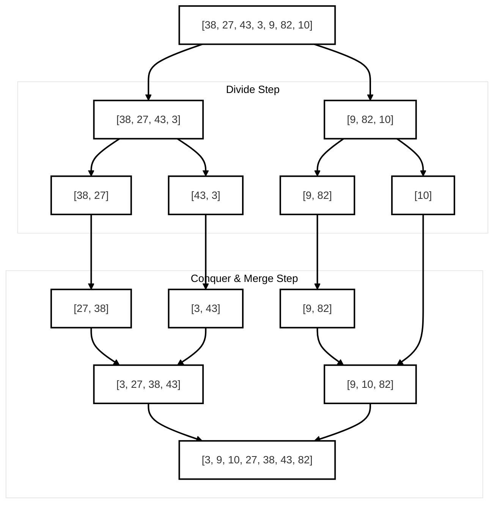
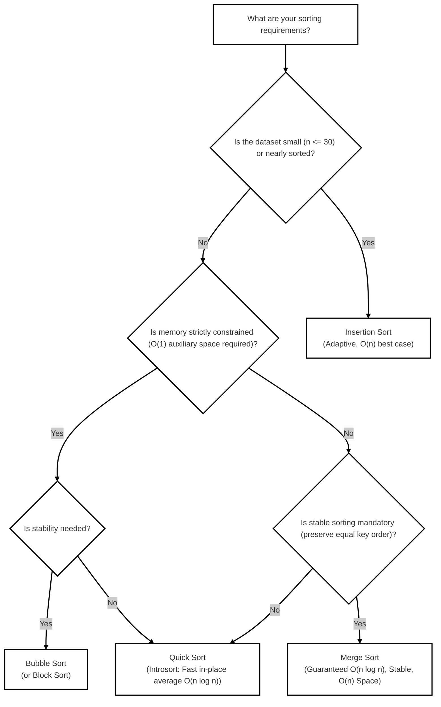

# Sorting Algorithms

> **Related Notes:** [[CS213]] | [[Introduction to Data Structure]] | [[Algorithm]] | [[Searching]]

---

> [!note] Popular Sorting Algorithms Overview
>
> 1. [[#1. Bubble Sort|Bubble Sort]] — Elementary comparison sort; repeatedly compares and swaps adjacent elements.
> 2. [[#2. Selection Sort|Selection Sort]] — Iteratively selects the minimum element from the unsorted subarray.
> 3. [[#3. Insertion Sort|Insertion Sort]] — Incrementally builds the sorted array by inserting each key into its correct relative position.
> 4. [[#4. Merge Sort|Merge Sort]] — Divide-and-conquer algorithm with guaranteed $\mathcal{O}(n \log n)$ time and stable sorting.
> 5. [[#5. Quick Sort|Quick Sort]] — Divide-and-conquer partitioning algorithm with fast practical cache performance and average $\mathcal{O}(n \log n)$ time.

---

## Asymptotic Complexity & Property Comparison

| Algorithm          |        Best Time        |      Average Time       |       Worst Time        |      Space Complexity       | Stable? | In-Place? | Paradigm                     |
| :----------------- | :---------------------: | :---------------------: | :---------------------: | :-------------------------: | :-----: | :-------: | :--------------------------- |
| **Bubble Sort**    |    $\mathcal{O}(n)$     |   $\mathcal{O}(n^2)$    |   $\mathcal{O}(n^2)$    |      $\mathcal{O}(1)$       |   Yes   |    Yes    | Comparison / Exchange        |
| **Selection Sort** |   $\mathcal{O}(n^2)$    |   $\mathcal{O}(n^2)$    |   $\mathcal{O}(n^2)$    |      $\mathcal{O}(1)$       |   No    |    Yes    | Comparison / Selection       |
| **Insertion Sort** |    $\mathcal{O}(n)$     |   $\mathcal{O}(n^2)$    |   $\mathcal{O}(n^2)$    |      $\mathcal{O}(1)$       |   Yes   |    Yes    | Incremental Insertion        |
| **Merge Sort**     | $\mathcal{O}(n \log n)$ | $\mathcal{O}(n \log n)$ | $\mathcal{O}(n \log n)$ |      $\mathcal{O}(n)$       |   Yes   |    No     | Divide & Conquer             |
| **Quick Sort**     | $\mathcal{O}(n \log n)$ | $\mathcal{O}(n \log n)$ |   $\mathcal{O}(n^2)$    | $\mathcal{O}(\log n)$ stack |   No    |    Yes    | Divide & Conquer / Partition |

> [!info] Understanding Stability in Sorting
> A sorting algorithm is **stable** if two objects with equal keys appear in the same relative order in the sorted output as they appeared in the input dataset. This property is crucial when sorting complex objects by multiple criteria (e.g., sorting by student ID after sorting by GPA).

---

## 1. Bubble Sort
<small>The most intuitive elementary exchange-based sorting method.</small>

### Conceptual Mechanism

Bubble Sort repeatedly traverses through the list, compares adjacent elements $(A[j], A[j+1])$, and swaps them if they are in the wrong order ($A[j] > A[j+1]$). With each full pass, the largest unsorted element "bubbles up" to its final correct position at the end of the array.

```
Pass 1 Example: [ 5 | 1 | 4 | 2 | 8 ]
  (5, 1) -> swap -> [ 1 | 5 | 4 | 2 | 8 ]
  (5, 4) -> swap -> [ 1 | 4 | 5 | 2 | 8 ]
  (5, 2) -> swap -> [ 1 | 4 | 2 | 5 | 8 ]
  (5, 8) -> no swap -> [ 1 | 4 | 2 | 5 | 8 ]  => '8' is locked in place!
```

### Complexity Breakdown

- **Best Case:** $\mathcal{O}(n)$ — When the array is already sorted, an optimized flag detects zero swaps on the first pass and halts early.
- **Average Case:** $\mathcal{O}(n^2)$ — Expects roughly $\frac{n(n-1)}{4}$ swaps and $\frac{n(n-1)}{2}$ comparisons.
- **Worst Case:** $\mathcal{O}(n^2)$ — Reverse-sorted input requires $\frac{n(n-1)}{2}$ comparisons and swaps.
- **Space Complexity:** $\mathcal{O}(1)$ auxiliary space (in-place).
- **Stability:** **Stable** (strictly adjacent swaps preserve relative order of equal keys).

### C++ Implementation

```cpp
#include <iostream>
#include <utility>

void bubbleSort(int arr[], int n) {
    for (int i = 0; i < n - 1; ++i) {
        bool swapped = false; // Optimization flag for early termination
        for (int j = 0; j < n - i - 1; ++j) {
            if (arr[j] > arr[j + 1]) {
                std::swap(arr[j], arr[j + 1]);
                swapped = true;
            }
        }
        // If no two elements were swapped in inner loop, array is sorted
        if (!swapped) break;
    }
}
```

---

## 2. Selection Sort
<small>Minimizes memory writes by performing at most $n - 1$ swaps.</small>

### Conceptual Mechanism

Selection Sort partitions the input array into two segments: a sorted subarray on the left and an unsorted subarray on the right. In each iteration $i$, the algorithm scans the entire unsorted subarray from index $i$ to $n-1$, finds the minimum element, and swaps it with the element at index $i$.

```
Initial: [ 64 | 25 | 12 | 22 | 11 ]
Pass 1: Find min in [64, 25, 12, 22, 11] -> 11. Swap with 64 -> [ 11 | 25 | 12 | 22 | 64 ]
Pass 2: Find min in [25, 12, 22, 64] -> 12. Swap with 25     -> [ 11 | 12 | 25 | 22 | 64 ]
Pass 3: Find min in [25, 22, 64] -> 22. Swap with 25         -> [ 11 | 12 | 22 | 25 | 64 ]
Pass 4: Find min in [25, 64] -> 25. Swap with itself         -> [ 11 | 12 | 22 | 25 | 64 ]
```

### Complexity Breakdown

- **Best Case:** $\mathcal{O}(n^2)$ — Must inspect all remaining elements regardless of initial ordering.
- **Average Case:** $\mathcal{O}(n^2)$ — $\sum_{i=0}^{n-2} (n - 1 - i) = \frac{n(n-1)}{2}$ comparisons.
- **Worst Case:** $\mathcal{O}(n^2)$ — Comparisons remain identical across all permutations.
- **Space Complexity:** $\mathcal{O}(1)$ auxiliary space (in-place).
- **Stability:** **Unstable** in array implementations because long-distance swaps can jump over identical elements (e.g., `[4a, 4b, 1]` swaps `4a` with `1`, placing `4a` after `4b`).

> [!tip] Advantage of Selection Sort
> Selection Sort executes at most $\mathcal{O}(n)$ write/swap operations. When write operations to persistent storage (such as flash memory or EEPROM) are significantly costlier than read operations, Selection Sort has a distinct advantage over Bubble Sort and Insertion Sort.

### C++ Implementation

```cpp
#include <iostream>
#include <utility>

void selectionSort(int arr[], int n) {
    for (int i = 0; i < n - 1; ++i) {
        int minIndex = i;
        for (int j = i + 1; j < n; ++j) {
            if (arr[j] < arr[minIndex]) {
                minIndex = j;
            }
        }
        if (minIndex != i) {
            std::swap(arr[i], arr[minIndex]);
        }
    }
}
```

---

## 3. Insertion Sort
<small>Adaptive, online sorting; highly efficient for small or nearly-sorted datasets.</small>

### Conceptual Mechanism

Insertion Sort behaves like sorting a hand of playing cards. At step $i$, the element $arr[i]$ (designated as `key`) is picked out. The algorithm scans backwards through the sorted segment $(0 \dots i-1)$, shifting all elements greater than `key` one position to the right, and then places `key` into the newly vacant slot.

```
Initial: [ 12 | 11 | 13 | 5 | 6 ]
Step 1: key = 11. 12 > 11 -> shift 12 -> [ 11 | 12 | 13 | 5 | 6 ]
Step 2: key = 13. 12 < 13 -> no shift -> [ 11 | 12 | 13 | 5 | 6 ]
Step 3: key = 5.  Shift 13, 12, 11    -> [  5 | 11 | 12 | 13 | 6 ]
Step 4: key = 6.  Shift 13, 12, 11    -> [  5 |  6 | 11 | 12 | 13 ]
```

### Complexity Breakdown

- **Best Case:** $\mathcal{O}(n)$ — If array is already sorted, only 1 comparison per element is performed with 0 shifts.
- **Average Case:** $\mathcal{O}(n^2)$ — Elements typically shift halfway through the sorted prefix.
- **Worst Case:** $\mathcal{O}(n^2)$ — Reverse-sorted arrays require shifting all previously processed elements every step.
- **Space Complexity:** $\mathcal{O}(1)$ auxiliary space (in-place).
- **Stability:** **Stable** (elements equal to `key` do not shift past it; the key is placed strictly after them).

> [!note] Practical Engineering Use Cases
> Insertion Sort is the algorithm of choice for:
>
> 1. Small arrays ($n \le 16$–$32$) due to minimal constant overhead and cache friendliness.
> 2. Nearly sorted data (runs in linear $\mathcal{O}(n)$ time).
> 3. Sub-routines in hybrid standard library sorts like **Timsort** (`std::stable_sort` / Python `sort()`) and **Introsort** (`std::sort`).

### C++ Implementation

```cpp
#include <iostream>

void insertionSort(int arr[], int n) {
    for (int i = 1; i < n; ++i) {
        int key = arr[i];
        int j = i - 1;

        // Shift elements of arr[0..i-1] that are greater than key to the right
        while (j >= 0 && arr[j] > key) {
            arr[j + 1] = arr[j];
            --j;
        }
        arr[j + 1] = key;
    }
}
```

---

## 4. Merge Sort
<small>Optimal, predictable divide-and-conquer sorting with guaranteed $\mathcal{O}(n \log n)$ time.</small>

### Conceptual Mechanism

Merge Sort operates by recursively splitting the array into two equal halves until each subarray consists of a single element (base case: size $\le 1$ is trivially sorted). It then repeatedly merges two sorted adjacent subarrays into a single sorted buffer.



### Recurrence Relation & Complexity

By the Master Theorem for divide-and-conquer recurrences:
$$T(n) = 2T\left(\frac{n}{2}\right) + \mathcal{O}(n) \implies T(n) = \mathcal{O}(n \log n)$$

- **Best Case:** $\mathcal{O}(n \log n)$ — Tree height is $\lceil \log_2 n \rceil$ levels; merging takes $\mathcal{O}(n)$ per level.
- **Average Case:** $\mathcal{O}(n \log n)$
- **Worst Case:** $\mathcal{O}(n \log n)$ — Deterministic and unaffected by input distribution.
- **Space Complexity:** $\mathcal{O}(n)$ auxiliary space to allocate temporary merge buffers.
- **Stability:** **Stable** (when $arr[left] \le arr[right]$, taking from the left subarray preserves original order).

### C++ Implementation

```cpp
#include <iostream>

void merge(int arr[], int left, int mid, int right) {
    int n1 = mid - left + 1;
    int n2 = right - mid;

    // Allocate temporary arrays
    int* L = new int[n1];
    int* R = new int[n2];

    for (int i = 0; i < n1; ++i) L[i] = arr[left + i];
    for (int j = 0; j < n2; ++j) R[j] = arr[mid + 1 + j];

    int i = 0, j = 0, k = left;
    while (i < n1 && j < n2) {
        if (L[i] <= R[j]) { // '<=' maintains algorithmic stability
            arr[k++] = L[i++];
        } else {
            arr[k++] = R[j++];
        }
    }

    while (i < n1) arr[k++] = L[i++];
    while (j < n2) arr[k++] = R[j++];

    delete[] L;
    delete[] R;
}

void mergeSort(int arr[], int left, int right) {
    if (left < right) {
        int mid = left + (right - left) / 2; // Prevents integer overflow
        mergeSort(arr, left, mid);
        mergeSort(arr, mid + 1, right);
        merge(arr, left, mid, right);
    }
}
```

---

## 5. Quick Sort
<small>The most widely adopted general-purpose in-place sorting algorithm.</small>

### Conceptual Mechanism

Quick Sort chooses an element as a **pivot** and partitions the array such that:

1. All elements smaller than the pivot are placed before it.
2. All elements greater than or equal to the pivot are placed after it.
3. The pivot is then in its definitive sorted index.
   The sub-arrays to the left and right of the pivot are sorted recursively.

```
Array: [ 10, 80, 30, 90, 40, 50, 70 ]  (Pivot = 70)
Lomuto Partitioning:
  Scanning indices, swapping smaller items forward.
  Elements < 70: [ 10, 30, 40, 50 ]
  Pivot index: 4  => [ 10, 30, 40, 50 | 70 | 90, 80 ]
  Recursively quicksort left [10, 30, 40, 50] and right [90, 80]
```

### Complexity Breakdown

- **Best Case:** $\mathcal{O}(n \log n)$ — Occurs when the pivot consistently divides the array into two roughly equal halves:
  $$T(n) = 2T\left(\frac{n}{2}\right) + \mathcal{O}(n) \implies \mathcal{O}(n \log n)$$
- **Average Case:** $\mathcal{O}(n \log n)$ — Even an unbalanced $90/10$ split yields $\mathcal{O}(n \log n)$ recursion depth.
- **Worst Case:** $\mathcal{O}(n^2)$ — Occurs when the pivot selected is consistently the smallest or largest element (e.g., already sorted array with naive first/last element pivot):
  $$T(n) = T(n - 1) + \mathcal{O}(n) \implies \mathcal{O}(n^2)$$
- **Space Complexity:** $\mathcal{O}(\log n)$ auxiliary stack frames on average; $\mathcal{O}(n)$ worst-case call stack depth.
- **Stability:** **Unstable** (partition swaps non-adjacent elements across the pivot boundary).

> [!tip] Mitigating Worst-Case Quick Sort
>
> - **Median-of-Three:** Choose the median of $arr[low]$, $arr[mid]$, and $arr[high]$ as pivot.
> - **Randomized Pivot:** Uniformly select a random index between $low$ and $high$ to thwart worst-case pathological inputs.
> - **Introsort:** Switch to Heap Sort if Quick Sort's recursion depth exceeds $2 \log_2 n$ (standard in C++ `std::sort`).

### C++ Implementation (Lomuto Partition Scheme)

```cpp
#include <iostream>
#include <utility>

int partition(int arr[], int low, int high) {
    int pivot = arr[high]; // Last element as pivot
    int i = low - 1;       // Index of smaller element

    for (int j = low; j < high; ++j) {
        if (arr[j] < pivot) {
            ++i;
            std::swap(arr[i], arr[j]);
        }
    }
    std::swap(arr[i + 1], arr[high]);
    return i + 1;
}

void quickSort(int arr[], int low, int high) {
    if (low < high) {
        int pi = partition(arr, low, high);
        quickSort(arr, low, pi - 1);
        quickSort(arr, pi + 1, high);
    }
}
```

---

## Summary & Decision Matrix


