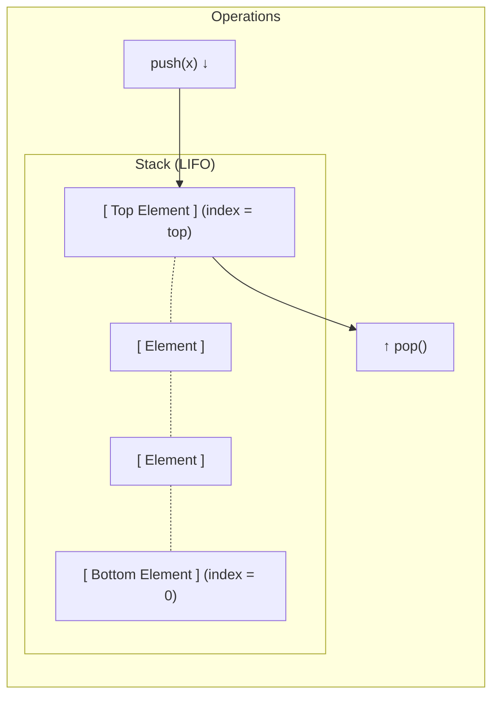

# 🥞 Stack ADT & Implementations

> [!info] Navigation: [[CSTU40]] > [[Year 2]] > [[Year 2 Semester 1]] > [[CS213]] > [[Stack]]
> **Related Notes:** [[CS213]] | [[Linked List]] | [[Queue]] | [[Memory]]

---

## 1. Stack Conceptual Overview

A **Stack** is a restricted linear data structure (Abstract Data Type) in which insertion and removal of elements take place at the same end, designated as the **top**. The opposite end is called the **bottom**.



- **LIFO (Last In, First Out):** The most recently inserted element is always the first one to be removed.
- **Key Operations:**

| Operation            | Description                                                                                                      |
| -------------------- | ---------------------------------------------------------------------------------------------------------------- |
| `push(x)`            | Inserts element $x$ onto the top of the stack.                                                                   |
| `pop()`              | Removes and returns the element currently at the top of the stack.                                               |
| `top()` <br>`peek()` | Returns the element at the top without removing it.                                                              |
| `isEmpty()`          | Checks whether the stack contains any elements.                                                                  |
| `isFull()`           | Checks whether the stack has reached its maximum capacity (applicable only to static/array implementations).<br> |

---

## 2. Array-Based Implementation (`Stack`)

In an array-based implementation, memory is allocated as a contiguous block. The variable `top` tracks the index of the highest item currently stored.

### Class Definition

```cpp
class Stack {
public:
    Stack(int size = 10);              // Constructor
    ~Stack() { delete [] values; }     // Destructor
    
    int IsEmpty();                     // Check if empty (1: true, 0: false)
    int IsFull();                      // Check if full (1: true, 0: false)
    double Top();                      // Return top element without popping
    void Push(const double x);         // Insert element at top
    double Pop();                      // Remove and return top element
    void DisplayStack();               // Print all elements from top to bottom

private:
    int maxTop;                        // Maximum top index (size - 1)
    int top;                           // Index of current top element (-1 if empty)
    double* values;                    // Dynamic array pointer storing elements
};
```

---

### Function Breakdown & Code Explanations

#### A. Constructor `Stack::Stack(int size)`
- **Description:** Dynamically allocates an array of type `double` with capacity `size` (defaults to 10). Initializes `top` to `-1` to indicate an empty stack and sets `maxTop = size - 1`.
- **Time Complexity:** $\mathcal{O}(1)$

```cpp
Stack::Stack(int size /* = 10 */) {
    values = new double[size];
    top = -1;             // -1 signifies that no valid elements exist yet
    maxTop = size - 1;    // Highest allowable index in zero-based indexing
}
```

#### B. Destructor `Stack::~Stack()`
- **Description:** Deallocates the dynamically allocated array `values` using `delete []` to prevent memory leaks.
- **Time Complexity:** $\mathcal{O}(1)$

```cpp
Stack::~Stack() {
    delete [] values;
}
```

#### C. `int Stack::IsEmpty()`
- **Description:** Returns `1` (true) if `top == -1`, confirming that the stack contains no elements; otherwise returns `0` (false).
- **Time Complexity:** $\mathcal{O}(1)$

```cpp
int Stack::IsEmpty() {
    return top == -1;
}
```

#### D. `int Stack::IsFull()`
- **Description:** Returns `1` (true) if `top == maxTop`, indicating that the array capacity has been exhausted; otherwise returns `0` (false).
- **Time Complexity:** $\mathcal{O}(1)$

```cpp
int Stack::IsFull() {
    return top == maxTop;
}
```

#### E. `void Stack::Push(const double x)`
- **Description:** Inserts element $x$ onto the stack. First verifies whether the stack is full via `IsFull()`. If full, reports an error (stack overflow). Otherwise, pre-increments `top` and stores $x$ at `values[++top]`.
- **Time Complexity:** $\mathcal{O}(1)$

```cpp
void Stack::Push(const double x) {
    if (IsFull()) {
        cout << "Error: the stack is full." << endl;
    } else {
        values[++top] = x; // Increment top first, then assign value
    }
}
```

#### F. `double Stack::Pop()`
- **Description:** Removes and returns the top element. First verifies whether the stack is empty via `IsEmpty()`. If empty, reports an error (stack underflow) and returns `-1`. Otherwise, retrieves `values[top]` and post-decrements `top`.
- **Time Complexity:** $\mathcal{O}(1)$

```cpp
double Stack::Pop() {
    if (IsEmpty()) {
        cout << "Error: the stack is empty." << endl;
        return -1;
    } else {
        return values[top--]; // Return current top element, then decrement index
    }
}
```

#### G. `double Stack::Top()`
- **Description:** Inspects and returns the element at the top of the stack without removing it or altering the `top` index. Returns `-1` if the stack is empty.
- **Time Complexity:** $\mathcal{O}(1)$

```cpp
double Stack::Top() {
    if (IsEmpty()) {
        cout << "Error: the stack is empty." << endl;
        return -1;
    } else {
        return values[top];   // Read top element without changing top index
    }
}
```

#### H. `void Stack::DisplayStack()`
- **Description:** Iterates backwards from index `top` down to index `0`, printing each element formatted as stack levels.
- **Time Complexity:** $\mathcal{O}(n)$

```cpp
void Stack::DisplayStack() {
    cout << "top -->";
    for (int i = top; i >= 0; i--) {
        cout << "	|	" << values[i] << "	|" << endl;
    }
    cout << "	|---------------|" << endl;
}
```

---

## 3. Linked List-Based Implementation (`StackLinkedList`)

In a linked list implementation, nodes are dynamically allocated on the heap. Because memory grows dynamically, a linked list stack never experiences overflow (does not become full) unless system memory is exhausted.

### Class Definition

```cpp
class StackLinkedList {
public:
    StackLinkedList() { head = tail = NULL; }
    ~StackLinkedList();

    void addToHead(double value);
    double removeFromHead();
    
    void push(double value);
    double pop();
    double top();
    int isEmpty();
    void displayStack();

protected:
    struct Node {
        double data;
        Node* next;
        Node(double x) { data = x; next = NULL; }
    };
    Node* head;    // Points to top of stack
    Node* tail;    // Points to bottom of stack
};
```

---

### Function Breakdown & Code Explanations

#### A. `int StackLinkedList::isEmpty()`
- **Description:** Returns `1` if `head == NULL`, indicating no nodes exist in the linked list.
- **Time Complexity:** $\mathcal{O}(1)$

```cpp
int StackLinkedList::isEmpty() {
    return head == NULL;
}
```

#### B. `void StackLinkedList::push(double value)` / `addToHead(double value)`
- **Description:** Prepends a new node holding `value` to the front of the list (`head`). If the stack was previously empty (`tail == NULL`), `tail` is also set to point to the new node.
- **Time Complexity:** $\mathcal{O}(1)$

```cpp
void StackLinkedList::addToHead(double value) {
    Node* temp = head;
    head = new Node(value);
    head->next = temp;

    // In case the list was initially empty
    if (tail == NULL) {
        tail = head;
    }
}

void StackLinkedList::push(double value) {
    addToHead(value);
}
```

#### C. `double StackLinkedList::pop()` / `removeFromHead()`
- **Description:** Removes the node at `head`. If the stack is empty, displays an underflow error message. Otherwise, extracts `head->data`, advances `head = head->next`, deletes the old node to reclaim memory, and returns the extracted value. If the list becomes empty, `tail` is reset to `NULL`.
- **Time Complexity:** $\mathcal{O}(1)$

```cpp
double StackLinkedList::removeFromHead() {
    if (head != NULL) {
        double result = head->data;
        Node* temp = head;
        
        if (head == tail) {
            head = tail = NULL; // Only 1 node existed
        } else {
            head = head->next;
        }
        
        delete temp;            // Free memory
        return result;
    } else {
        cout << "The stack is empty." << endl;
        return -1;
    }
}

double StackLinkedList::pop() {
    return removeFromHead();
}
```

#### D. `double StackLinkedList::top()`
- **Description:** Inspects and returns `head->data` without detaching or deleting the node. Returns `-1` if empty.
- **Time Complexity:** $\mathcal{O}(1)$

```cpp
double StackLinkedList::top() {
    if (isEmpty()) {
        cout << "Error: the stack is empty." << endl;
        return -1;
    } else {
        return head->data;
    }
}
```

#### E. `void StackLinkedList::displayStack()`
- **Description:** Traverses from `head` along `next` pointers to the end of the list, printing each node's value and counting the total number of nodes.
- **Time Complexity:** $\mathcal{O}(n)$

```cpp
void StackLinkedList::displayStack() {
    int num = 0;
    Node* currNode = head;
    cout << "top -->";
    while (currNode != NULL) {
        cout << "	|	" << currNode->data << "	|" << endl;
        currNode = currNode->next;
        num++;
    }
    cout << "	|---------------|" << endl;
    cout << "
Number of nodes in the list: " << num << endl;
}
```

---

## 4. Key Applications of Stacks

1. **Balancing Symbols & Parentheses:**
   - Scan expression characters from left to right.
   - Push opening brackets `(`, `[`, `{` onto the stack.
   - When encountering closing brackets `)`, `]`, `}`, pop from the stack and verify that the popped symbol matches the bracket type.
   - At end of expression, the stack must be empty.

2. **Expression Evaluation (Infix to Postfix):**
   - Infix: $A + B * C$ (requires operator precedence & parentheses).
   - Postfix (Reverse Polish Notation): $A\ B\ C\ *\ +$ (no parentheses required).
   - Operators are pushed onto the stack and popped to output when an incoming operator has lower or equal precedence.
