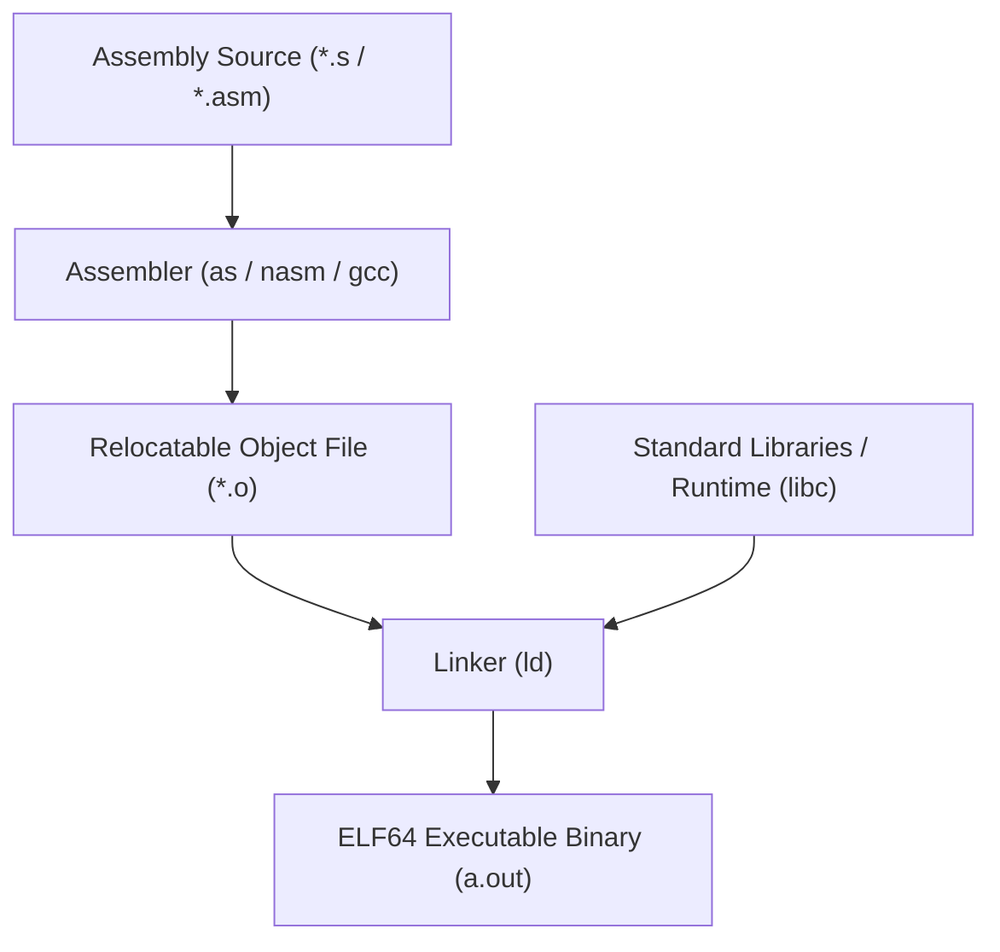

# ⚙️ Assembly Program

> [!info] Navigation: [[CSTU40]] > [[Year 2]] > [[Year 2 Semester 1]] > [[CS221]] > [[Assembly]]
> **Related Notes:** [[Instructions]] | [[General Purpose]] | [[Register Architectures]] | [[Exercise]] | [[CS221]] | [[CS102]]

---

## 1. Specification & Target Architecture
- **Architecture Specification:** ==Intel / AMD64 (x86_64)==
- **Binary / Object Format:** `ELF64` (Executable and Linkable Format, 64-bit)

---

## 2. Compilation & Linking Toolchain

> [!note] **Toolchain Stages:**
> 1. **Assembler (`as`):** Translates human-readable mnemonic assembly source code into binary machine instructions and relocatable object files (`.o`).
> 2. **Linker (`ld`):** Combines object files with system runtimes and standard shared/static libraries to resolve external symbol references and generate the final runnable executable.
> 3. **Connection to C Foundations:** Connects to compilation concepts from [[CS102]] and low-level memory layout in [[CS213#Memory Management]].
