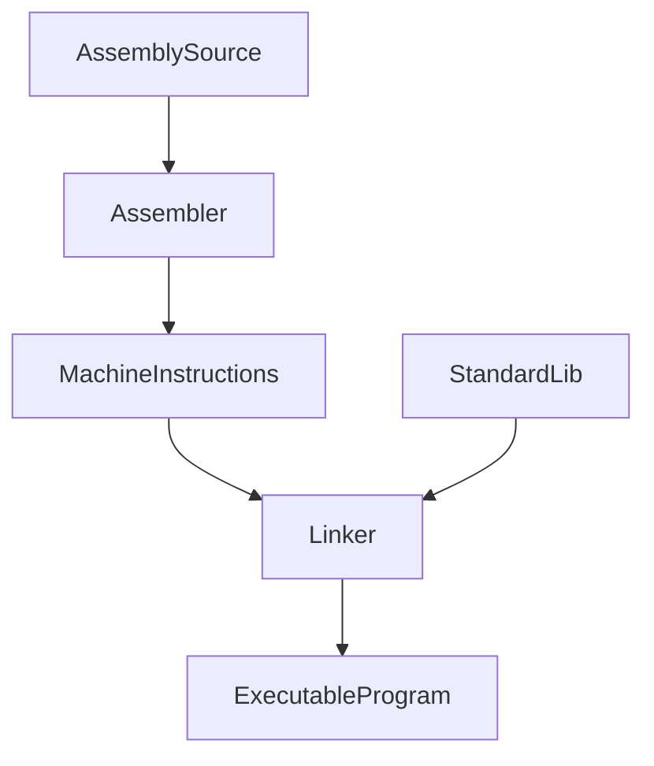

# Assembly Program

**spec:** ==intel/amd64== x86_64, elf64 format.

```mermaid
flowchart TD
	AssemblySource --> Assembler
	Assembler --> MachineInstructions
	MachineInstructions --> Linker
	StandardLib --> Linker
	Linker --> ExecutableProgram
```

