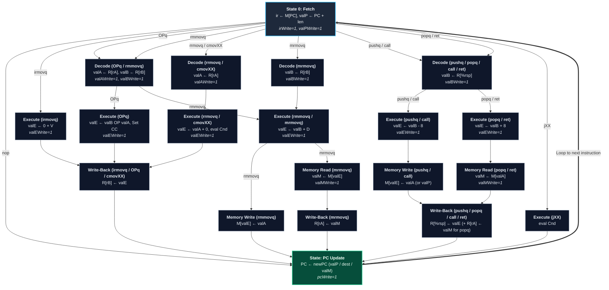

# Y86_64 Multi-Cycle

> **Related Notes:** [[CS221]] | [[Y86_64]] | [[Instructions]] | [[Concurrency of CPU]] | [[Exercise]]

---

## 1. Single-Cycle vs. Multi-Cycle Motivation

> [!faq] Limitation of Single-Cycle Implementation
> - The single-cycle implementation is constrained to use only **one clock cycle** for every type of instruction.
> - The clock period must be sufficiently long to accommodate the worst-case critical path (covering all computation stages), even though many instructions require only a subset of these steps.
> - The performance and clock frequency of the processor can be significantly improved if we shorten the clock cycle period and execute instructions across variable numbers of cycles.
> 
> ![[Screenshot 2569-09-15 at 14.14.49.png]]

> [!note] Multi-Cycle Implementation Principles
> - The multi-cycle implementation performs only a subset of computation steps (typically one logical stage: Fetch, Decode, Execute, Memory, Write-Back, PC Update) in each cycle.
> - Consequently, the clock period is much shorter than in the single-cycle architecture.
> - Individual instructions require multiple cycles to complete, but simpler instructions finish faster than complex memory-referencing instructions.
> 
> ![[Screenshot 2569-09-15 at 14.15.22.png]]

One clock cycle is allocated for executing one stage. Different instruction types require different numbers of cycles, yielding variable execution times.

---

## 2. Datapath & Temporary Registers

To maintain intermediate values across multiple clock cycles, dedicated **temporary storage registers** are introduced into the datapath:
- Intermediate values (`ir`, `valP`, `valA`, `valB`, `valE`, `valM`, `PC`) must persist across cycle transitions.
- Control signals (e.g., `irWrite`, `valPWrite`, `valAWrite`, `valBWrite`, `valEWrite`, `valMWrite`, `pcWrite`) govern register latching:
  - Set to ==1==: Update the corresponding temporary storage register on the next clock edge.
  - Set to ==0==: Preserve the current register contents unchanged.

### Execution Trace Examples

#### A. `nop` Instruction (2 Cycles)
The `nop` instruction only requires instruction fetching and program counter advancement:

| Cycle | irWrite | valPWrite | valAWrite | valBWrite | valEWrite | valMWrite | pcWrite |
| :--- | :---: | :---: | :---: | :---: | :---: | :---: | :---: |
| **1. Fetch** | 1 | 1 | 0 | 0 | 0 | 0 | 0 |
| **2. PC Update** | 0 | 0 | 0 | 0 | 0 | 0 | 1 |

#### B. `irmovq V, rB` Instruction (4 Cycles)
Execution breakdown for moving an immediate constant into register `rB`:

| Cycle | irWrite | valPWrite | valAWrite | valBWrite | valEWrite | valMWrite | pcWrite |
| :--- | :---: | :---: | :---: | :---: | :---: | :---: | :---: |
| **1. Fetch** | 1 | 1 | 0 | 0 | 0 | 0 | 0 |
| **2. Execute** | 0 | 0 | 0 | 0 | 1 | 0 | 0 |
| **3. Write Back** | 0 | 0 | 0 | 0 | 0 | 0 | 0 |
| **4. PC Update** | 0 | 0 | 0 | 0 | 0 | 0 | 1 |

---

## 3. Control Unit Design

> [!abstract] Multi-Cycle Control Unit FSM (CS221 Docs #4, pp. 14–15)
> Unlike single-cycle processors where control signals are combinational logic driven in one cycle, the multi-cycle Control Unit operates as a synchronous **Finite State Machine (FSM)** consisting of:
> 1. **State Register**: Holds the current execution state (step) and advances on clock edges.
> 2. **Next-State Logic (Combinational)**: Determines the next state based on the current state, instruction code (`icode`), function code (`ifun`), and branch condition evaluation (`Cnd`).
> 3. **Output / Control Signal Logic (Combinational)**: Asserts the datapath control signals (temporary register write enables, multiplexer selectors, ALU functions, memory read/write) corresponding to the current state.

### Multi-Cycle Control Signal Matrix

| Stage / State | `irWrite` | `valPWrite` | `valAWrite` | `valBWrite` | `valEWrite` | `valMWrite` | `pcWrite` | Notes |
| :--- | :---: | :---: | :---: | :---: | :---: | :---: | :---: | :--- |
| **Fetch** | 1 | 1 | 0 | 0 | 0 | 0 | 0 | Reads `ir = M1[PC]`, computes `valP = PC + len` |
| **Decode** | 0 | 0 | 1 | 1 | 0 | 0 | 0 | Reads source registers into `valA`, `valB` |
| **Execute** | 0 | 0 | 0 | 0 | 1 | 0 | 0 | ALU operation / effective address calculation; evaluates `Cnd` |
| **Memory Read** | 0 | 0 | 0 | 0 | 0 | 1 | 0 | Reads memory word into temporary register `valM` |
| **Memory Write** | 0 | 0 | 0 | 0 | 0 | 0 | 0 | Writes `valA` or `valP` to memory at address `valE` |
| **Write-Back** | 0 | 0 | 0 | 0 | 0 | 0 | 0 | Writes `valE` or `valM` back to register file |
| **PC Update** | 0 | 0 | 0 | 0 | 0 | 0 | 1 | Updates `PC` with next instruction address; loops to Fetch |

### Control Unit Finite State Machine (FSM) Diagram

---
