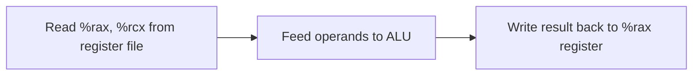
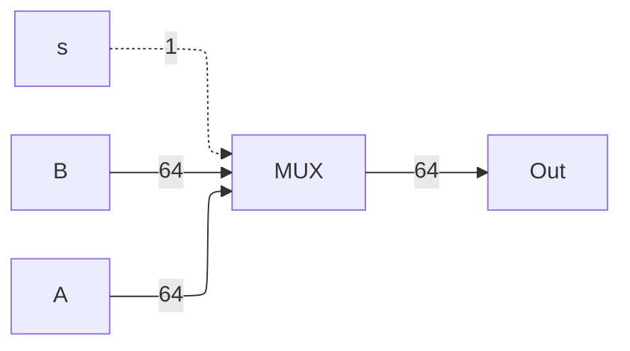
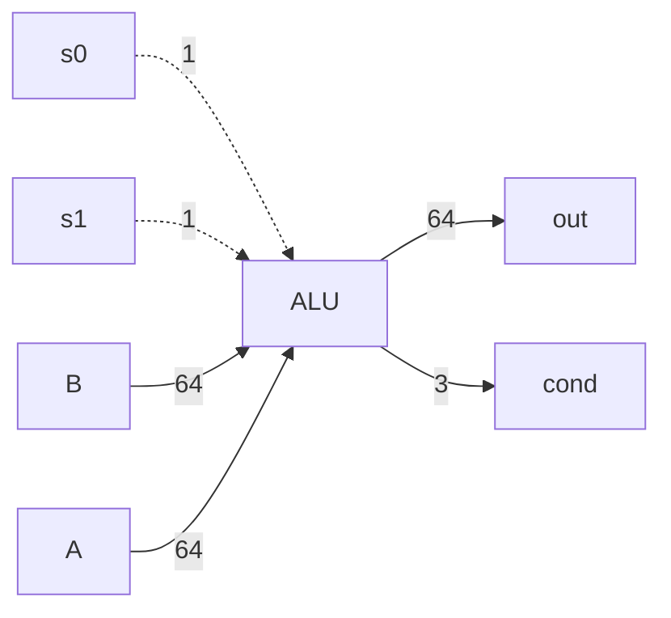

# ⚙️ Y86-64 Architecture & Processor Datapath

> [!info] Navigation: [[CSTU40]] > [[Year 2]] > [[Year 2 Semester 1]] > [[CS221]] > [[Y86_64]]
> **Related Notes:** [[CS221]] | [[General Purpose]] | [[Register Architectures]] | [[Instructions]] | [[Array]]

---

## 1. Datapath

A **Datapath** is a network of storage units or registers and ALU (Arithmetic and Logic Unit) connected by buses where the timing is controlled by clocks.

Executing an instruction is equivalent to controlling the flow of data from one place to another place through various components.

**Example:** `add %rcx, %rax`

---

## 2. Basic Hardware Components

1. Multiplexer (MUX)
2. Arithmetic and Logic Unit (ALU)
3. Register File & Memory

### A. Multiplexer (MUX)

Used to **choose** a value from a set. It selects one input based on a control signal $s$.

Where $s$ is the selection bit choosing between $A$ or $B$:

$$	ext{out} = \begin{cases}
A & 	ext{if } s = 0 \
B & 	ext{if } s = 1
\end{cases}$$

### B. Arithmetic and Logic Unit (ALU)

The Arithmetic and Logic Unit (ALU) is a digital circuit for executing arithmetic and logical operations.

The condition flags (`cond`) are updated based on the output result (e.g., ZF, SF, OF).

### C. Register File & Memory

Registers and Memory are hardware components capable of storing values. They are synchronous sequential circuits working with a global clock signal.

![[Screenshot 2569-09-03 at 14.28.46.png|365]]

When a register number (a 4-bit integer) is fed to `srcA`, the value of the register can be obtained from `valA`. This is the same for `srcB` and `valB`.

To write a value to a register, the register number and the value to be written need to be provided:
- There are two channels to write values: `dstE`/`valE`, and `dstM`/`valM`.
- The state of the register is updated on the rising edge of the clock signal.

#### Register ID Encoding Table

| Name | Code (Hex) | Name | Code (Hex) |
| :--- | :--- | :--- | :--- |
| `%rax` | `0` | `%r8`  | `8` |
| `%rcx` | `1` | `%r9`  | `9` |
| `%rdx` | `2` | `%r10` | `a` |
| `%rbx` | `3` | `%r11` | `b` |
| `%rsp` | `4` | `%r12` | `c` |
| `%rbp` | `5` | `%r13` | `d` |
| `%rsi` | `6` | `%r14` | `e` |
| `%rdi` | `7` | `%r15` | `f` |

**Read `%rax` using port A:**
1. Set `srcA` to `0000` (or `0`)
2. Read value from `valA`

**Write `10` to `%r9` using port E:**
1. Set `dstE` to `1001` (or `9`)
2. Set value `valE` to `$10`

---

## 3. Memory Subsystem

![[Screenshot 2569-09-03 at 14.42.14.png|280]]

**Memory** is similar to the register file, but stores much larger amounts of data addressed by 64-bit addresses. 

There are two control signals for the memory unit: `read` and `write`.
- When $	ext{read} = 1$ and $	ext{write} = 0$, `data out` reflects the value stored at the address.
- When $	ext{read} = 0$ and $	ext{write} = 1$, `data in` is written into the specified address on the rising clock edge.
