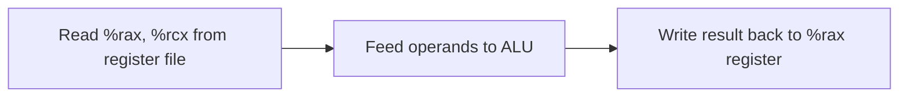
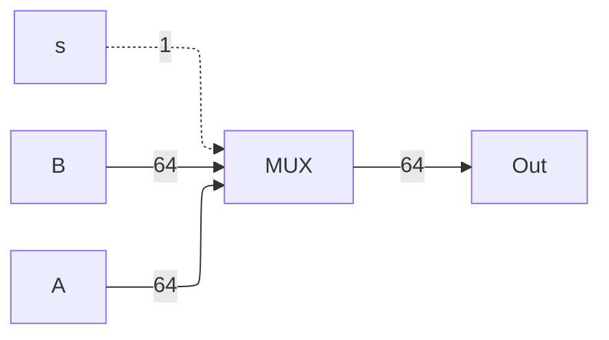
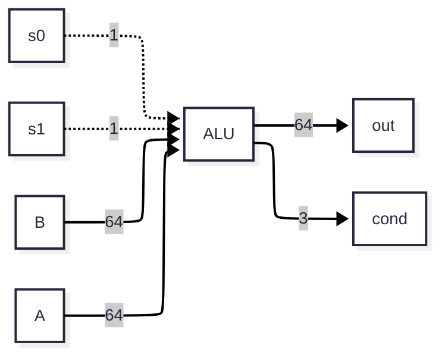
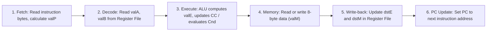

# ⚙️ Y86-64 Architecture & Instruction Set

> [!info] Navigation: [[CSTU40]] > [[Year 2]] > [[Year 2 Semester 1]] > [[CS221]] > [[Y86_64]]
> **Related Notes:** [[CS221]] | [[General Purpose]] | [[Register Architectures]] | [[Assembly]] | [[Array]] | [[Exercise]]

---

## 1. Datapath

A **Datapath** is a network of storage units or registers and ALU (Arithmetic and Logic Unit) connected by buses where the timing is controlled by clocks.

Executing an instruction is equivalent to controlling the flow of data from one place to another place through various components.

**Example:** `addq %rcx, %rax`

---

## 2. Basic Hardware Components

1. Multiplexer (MUX)
2. Arithmetic and Logic Unit (ALU)
3. Register File & Memory

### A. Multiplexer (MUX)

Used to **choose** a value from a set. It selects one input based on a control signal $s$.

Where $s$ is the selection bit choosing between $A$ or $B$:

$$
ext{out} = \begin{cases}
A & 	ext{if } s = 0 \\
B & 	ext{if } s = 1
\end{cases}
$$

### B. Arithmetic and Logic Unit (ALU)

The Arithmetic and Logic Unit (ALU) is a digital circuit for executing arithmetic and logical operations.

The condition flags (`cond`) are updated based on the output result (e.g., `ZF`, `SF`, `OF`).

### C. Register File & Memory

Registers and Memory are hardware components capable of storing values. They are synchronous sequential circuits working with a global clock signal.

![[Screenshot 2569-09-03 at 14.28.46.png|365]]

When a register number (a 4-bit integer) is fed to `srcA`, the value of the register can be obtained from `valA`. This is the same for `srcB` and `valB`.

To write a value to a register, the register number and the value to be written need to be provided:

- There are two channels to write values: `dstE`/`valE`, and `dstM`/`valM`.
- The state of the register is updated on the rising edge of the clock signal.

#### Register ID Encoding Table

| Register Name   | ID (Hex) | Description                                                          |
| :-------------- | :------- | :------------------------------------------------------------------- |
| `%rax`          | `0`      | Return value / accumulator                                           |
| `%rcx`          | `1`      | 4th argument / counter                                               |
| `%rdx`          | `2`      | 3rd argument                                                         |
| `%rbx`          | `3`      | Callee-saved register                                                |
| `%rsp`          | `4`      | Stack pointer                                                        |
| `%rbp`          | `5`      | Frame pointer / Callee-saved                                         |
| `%rsi`          | `6`      | 2nd argument                                                         |
| `%rdi`          | `7`      | 1st argument                                                         |
| `%r8`           | `8`      | 5th argument                                                         |
| `%r9`           | `9`      | 6th argument                                                         |
| `%r10`          | `a`      | Caller-saved temporary                                               |
| `%r11`          | `b`      | Caller-saved temporary                                               |
| `%r12`          | `c`      | Callee-saved register                                                |
| `%r13`          | `d`      | Callee-saved register                                                |
| `%r14`          | `e`      | Callee-saved register                                                |
| **No Register** | `f`      | `RNONE` (used when an instruction field does not require a register) |

---

## 3. Memory Subsystem

![[Screenshot 2569-09-03 at 14.42.14.png|280]]

**Memory** is similar to the register file, but stores much larger amounts of data addressed by 64-bit addresses.

There are two control signals for the memory unit: `read` and `write`.

- When $ ext{read} = 1$ and $ ext{write} = 0$, `data out` reflects the 8-byte value stored at the address.
- When $ ext{read} = 0$ and $ ext{write} = 1$, `data in` is written into the specified address on the rising clock edge.

---

## 4. Y86-64 Instruction Set Architecture (ISA)

Y86-64 is a simplified, RISC-like instruction set architecture modeled on x86-64:

- **Word size:** 64 bits (8 bytes). All integer arithmetic and memory transfers operate on 8-byte words.
- **Instruction Encoding:** Length ranges from **1 byte to 10 bytes**.
- **Instruction Byte:** Composed of two 4-bit nibbles:
  - `icode` (Instruction Code, bits 4–7)
  - `ifun` (Instruction Function, bits 0–3)
- **Register Specifier Byte:** `rA:rB` (4 bits for register A, 4 bits for register B; `0xf` denotes no register).
- **Constant Word ($valC$):** 8-byte immediate integer or memory displacement address, stored in **little-endian** byte order.

### Complete Instruction Encoding Table

| Instruction | Assembly Syntax    | Byte 0 (`icode:ifun`) | Byte 1 (`rA:rB`) | Bytes 2–9 (`valC`) | Length | Description                                                                             |
| :---------- | :----------------- | :-------------------- | :--------------- | :----------------- | :----: | :-------------------------------------------------------------------------------------- |
| **halt**    | `halt`             | `00`                  | —                | —                  |  1 B   | Stop instruction execution; set `Stat` to `HLT`                                         |
| **nop**     | `nop`              | `10`                  | —                | —                  |  1 B   | No operation                                                                            |
| **rrmovq**  | `rrmovq rA, rB`    | `20`                  | `rA rB`          | —                  |  2 B   | Register-to-register transfer: $R[rB] \leftarrow R[rA]$                                 |
| **irmovq**  | `irmovq V, rB`     | `30`                  | `F rB`           | `V` (8B)           |  10 B  | Immediate-to-register move: $R[rB] \leftarrow V$                                        |
| **rmmovq**  | `rmmovq rA, D(rB)` | `40`                  | `rA rB`          | `D` (8B)           |  10 B  | Register-to-memory store: $M_8[D + R[rB]] \leftarrow R[rA]$                             |
| **mrmovq**  | `mrmovq D(rB), rA` | `50`                  | `rA rB`          | `D` (8B)           |  10 B  | Memory-to-register load: $R[rA] \leftarrow M_8[D + R[rB]]$                              |
| **OPq**     | `OPq rA, rB`       | `6 fn`                | `rA rB`          | —                  |  2 B   | Integer arithmetic/logical operation: $R[rB] \leftarrow R[rB] 	ext{ OP } R[rA]$; sets CC |
| **jXX**     | `jXX Dest`         | `7 fn`                | —                | `Dest` (8B)        |  9 B   | Conditional or unconditional jump to `Dest`                                             |
| **cmovXX**  | `cmovXX rA, rB`    | `2 fn`                | `rA rB`          | —                  |  2 B   | Conditional register move: $R[rB] \leftarrow R[rA]$ if condition holds                  |
| **call**    | `call Dest`        | `80`                  | —                | `Dest` (8B)        |  9 B   | Push return address onto stack; jump to `Dest`                                          |
| **ret**     | `ret`              | `90`                  | —                | —                  |  1 B   | Pop return address from stack into PC                                                   |
| **pushq**   | `pushq rA`         | `A0`                  | `rA F`           | —                  |  2 B   | Push register onto stack: decrement `%rsp` by 8, write $R[rA]$                          |
| **popq**    | `popq rA`          | `B0`                  | `rA F`           | —                  |  2 B   | Pop top of stack into register: read memory, increment `%rsp` by 8                      |

---

### Detailed Instruction Categories

#### A. Integer Operations (`OPq`) — `icode = 6`

All arithmetic and logic instructions take two register operands (`rA` and `rB`), compute $R[rB] \leftarrow R[rB] 	ext{ OP } R[rA]$, and update the condition codes (`ZF`, `SF`, `OF`):

| Instruction   | Function Code (`ifun`) |  Encoding  | Operation                                                           | Condition Codes Updated |
| :------------ | :--------------------: | :--------: | :------------------------------------------------------------------ | :---------------------: |
| `addq rA, rB` |          `0`           | `60 rA rB` | $R[rB] \leftarrow R[rB] + R[rA]$                                    | Yes (`ZF`, `SF`, `OF`)  |
| `subq rA, rB` |          `1`           | `61 rA rB` | $R[rB] \leftarrow R[rB] - R[rA]$ _(Note: subtracts $rA$ from $rB$)_ | Yes (`ZF`, `SF`, `OF`)  |
| `andq rA, rB` |          `2`           | `62 rA rB` | $R[rB] \leftarrow R[rB] \ \& \ R[rA]$                               | Yes (`ZF`, `SF`, `OF`)  |
| `xorq rA, rB` |          `3`           | `63 rA rB` | $R[rB] \leftarrow R[rB] \oplus R[rA]$                               | Yes (`ZF`, `SF`, `OF`)  |

#### B. Jump Instructions (`jXX`) — `icode = 7`

Branches examine condition codes to determine whether to take the jump to target address `Dest`:

| Instruction | Function Code (`ifun`) | Encoding  | Condition Description    | Test Flag Condition                 |
| :---------- | :--------------------: | :-------: | :----------------------- | :---------------------------------- |
| `jmp Dest`  |          `0`           | `70 Dest` | Unconditional jump       | Always $1$                          |
| `jle Dest`  |          `1`           | `71 Dest` | Jump if less or equal    | $(SF \oplus OF) \mid ZF$            |
| `jl Dest`   |          `2`           | `72 Dest` | Jump if strictly less    | $SF \oplus OF$                      |
| `je Dest`   |          `3`           | `73 Dest` | Jump if equal / zero     | $ZF = 1$                            |
| `jne Dest`  |          `4`           | `74 Dest` | Jump if not equal        | $ZF = 0$                            |
| `jge Dest`  |          `5`           | `75 Dest` | Jump if greater or equal | $\sim(SF \oplus OF)$                |
| `jg Dest`   |          `6`           | `76 Dest` | Jump if strictly greater | $\sim(SF \oplus OF) \ \& \ \sim ZF$ |

#### C. Conditional Move Instructions (`cmovXX`) — `icode = 2`

Moves the value from register `rA` to register `rB` only if the condition flag evaluates to true:

| Instruction     | Function Code (`ifun`) |  Encoding  | Condition Description    | Condition Test                      |
| :-------------- | :--------------------: | :--------: | :----------------------- | :---------------------------------- |
| `rrmovq rA, rB` |          `0`           | `20 rA rB` | Unconditional move       | Always $1$                          |
| `cmovle rA, rB` |          `1`           | `21 rA rB` | Move if less or equal    | $(SF \oplus OF) \mid ZF$            |
| `cmovl rA, rB`  |          `2`           | `22 rA rB` | Move if strictly less    | $SF \oplus OF$                      |
| `cmove rA, rB`  |          `3`           | `23 rA rB` | Move if equal / zero     | $ZF = 1$                            |
| `cmovne rA, rB` |          `4`           | `24 rA rB` | Move if not equal        | $ZF = 0$                            |
| `cmovge rA, rB` |          `5`           | `25 rA rB` | Move if greater or equal | $\sim(SF \oplus OF)$                |
| `cmovg rA, rB`  |          `6`           | `26 rA rB` | Move if strictly greater | $\sim(SF \oplus OF) \ \& \ \sim ZF$ |

#### D. Stack & Subroutine Instructions

The Y86-64 stack grows downward in memory from high addresses to low addresses, tracked by `%rsp` (register `4`):

1. **`pushq rA` (Encoding: `A0 rA F`):**
   - Decrement `%rsp` by 8: $R[\%rsp] \leftarrow R[\%rsp] - 8$
   - Store $R[rA]$ at memory: $M_8[R[\%rsp]] \leftarrow R[rA]$
2. **`popq rA` (Encoding: `B0 rA F`):**
   - Read value from top of stack: $R[rA] \leftarrow M_8[R[\%rsp]]$
   - Increment `%rsp` by 8: $R[\%rsp] \leftarrow R[\%rsp] + 8$
3. **`call Dest` (Encoding: `80 Dest`):**
   - Push address of next instruction ($valP$) onto the stack:
     $$R[\%rsp] \leftarrow R[\%rsp] - 8, \quad M_8[R[\%rsp]] \leftarrow valP$$
   - Set program counter to function start: $PC \leftarrow Dest$
4. **`ret` (Encoding: `90`):**
   - Pop return address from stack: $PC \leftarrow M_8[R[\%rsp]]$
   - Increment `%rsp`: $R[\%rsp] \leftarrow R[\%rsp] + 8$

---

## 5. Single-Cycle Implementation (Sequential Stages)

In a single-cycle implementation (SEQ), every instruction passes through up to **6 hardware stages** during a single clock cycle:

### Stage-by-Stage Instruction Execution Breakdown

| Instruction                         | Fetch                                                                                                                       | Decode                                                   | Execute                                                              | Memory                      | Write-back                                            | PC Update                             |
| :---------------------------------- | :-------------------------------------------------------------------------------------------------------------------------- | :------------------------------------------------------- | :------------------------------------------------------------------- | :-------------------------- | :---------------------------------------------------- | :------------------------------------ |
| **`halt`**                          | $icode:ifun \leftarrow M_1[PC]$ $valP \leftarrow PC + 1$                                                                 | —                                                        | —                                                                    | —                           | —                                                     | $Stat \leftarrow HLT$                 |
| **`nop`**                           | $icode:ifun \leftarrow M_1[PC]$ $valP \leftarrow PC + 1$                                                                 | —                                                        | —                                                                    | —                           | —                                                     | $PC \leftarrow valP$                  |
| **`rrmovq rA, rB`**                 | $icode:ifun \leftarrow M_1[PC]$ $rA:rB \leftarrow M_1[PC+1]$ $valP \leftarrow PC + 2$                                 | $valA \leftarrow R[rA]$                                  | $valE \leftarrow valA + 0$                                           | —                           | $R[rB] \leftarrow valE$                               | $PC \leftarrow valP$                  |
| **`irmovq V, rB`**                  | $icode:ifun \leftarrow M_1[PC]$ $rA:rB \leftarrow M_1[PC+1]$ $valC \leftarrow M_8[PC+2]$ $valP \leftarrow PC + 10$ | —                                                        | $valE \leftarrow 0 + valC$                                           | —                           | $R[rB] \leftarrow valE$                               | $PC \leftarrow valP$                  |
| **`rmmovq rA, D(rB)`**              | $icode:ifun \leftarrow M_1[PC]$ $rA:rB \leftarrow M_1[PC+1]$ $valC \leftarrow M_8[PC+2]$ $valP \leftarrow PC + 10$ | $valA \leftarrow R[rA]$ $valB \leftarrow R[rB]$       | $valE \leftarrow valB + valC$                                        | $M_8[valE] \leftarrow valA$ | —                                                     | $PC \leftarrow valP$                  |
| **`mrmovq D(rB), rA`**              | $icode:ifun \leftarrow M_1[PC]$ $rA:rB \leftarrow M_1[PC+1]$ $valC \leftarrow M_8[PC+2]$ $valP \leftarrow PC + 10$ | $valB \leftarrow R[rB]$                                  | $valE \leftarrow valB + valC$                                        | $valM \leftarrow M_8[valE]$ | $R[rA] \leftarrow valM$                               | $PC \leftarrow valP$                  |
| **`OPq rA, rB`**                    | $icode:ifun \leftarrow M_1[PC]$ $rA:rB \leftarrow M_1[PC+1]$ $valP \leftarrow PC + 2$                                 | $valA \leftarrow R[rA]$ $valB \leftarrow R[rB]$       | $valE \leftarrow valB 	\text{ }ext\{ OP \}\text{ } valA$ Set $CC$ | —                           | $R[rB] \leftarrow valE$                               | $PC \leftarrow valP$                  |
| **`jXX Dest`**                      | $icode:ifun \leftarrow M_1[PC]$ $valC \leftarrow M_8[PC+1]$ $valP \leftarrow PC + 9$                                  | —                                                        | $Cnd \leftarrow 	ext\{Cond\}(CC, ifun)$                              | —                           | —                                                     | $PC \leftarrow Cnd \ ? \ valC : valP$ |
| **`cmovXX rA, rB`**                 | $icode:ifun \leftarrow M_1[PC]$ $rA:rB \leftarrow M_1[PC+1]$ $valP \leftarrow PC + 2$                                 | $valA \leftarrow R[rA]$                                  | $valE \leftarrow valA + 0$ $Cnd \leftarrow 	ext{Cond}(CC, ifun)$  | —                           | If $Cnd$: $R[rB] \leftarrow valE$                  | $PC \leftarrow valP$                  |
| **`call Dest`**  `push & jmp` | $icode:ifun \leftarrow M_1[PC]$ $valC \leftarrow M_8[PC+1]$ $valP \leftarrow PC + 9$                                  | $valB \leftarrow R[\%rsp]$                               | $valE \leftarrow valB + (-8)$                                        | $M_8[valE] \leftarrow valP$ | $R[\%rsp] \leftarrow valE$                            | $PC \leftarrow valC$                  |
| **`ret`**  `pop & jmp`        | $icode:ifun \leftarrow M_1[PC]$ $valP \leftarrow PC + 1$                                                                 | $valA \leftarrow R[\%rsp]$ $valB \leftarrow R[\%rsp]$ | $valE \leftarrow valB + 8$                                           | $valM \leftarrow M_8[valA]$ | $R[\%rsp] \leftarrow valE$                            | $PC \leftarrow valM$                  |
| **`pushq rA`**                      | $icode:ifun \leftarrow M_1[PC]$ $rA:rB \leftarrow M_1[PC+1]$ $valP \leftarrow PC + 2$                                 | $valA \leftarrow R[rA]$ $valB \leftarrow R[\%rsp]$    | $valE \leftarrow valB + (-8)$                                        | $M_8[valE] \leftarrow valA$ | $R[\%rsp] \leftarrow valE$                            | $PC \leftarrow valP$                  |
| **`popq rA`**                       | $icode:ifun \leftarrow M_1[PC]$ $rA:rB \leftarrow M_1[PC+1]$ $valP \leftarrow PC + 2$                                 | $valA \leftarrow R[\%rsp]$ $valB \leftarrow R[\%rsp]$ | $valE \leftarrow valB + 8$                                           | $valM \leftarrow M_8[valA]$ | $R[\%rsp] \leftarrow valE$ $R[rA] \leftarrow valM$ | $PC \leftarrow valP$                  |

### ALU Instructions Operation

| Stage      | Instruction / Signal | Value / Action                                  |
| ---------- | -------------------- | ----------------------------------------------- |
| Header     | OP rA, rB            | $6 \mid \text{X} \mid \text{rA} \mid \text{rB}$ |
| Fetch      | icode, ifun          | $icode{:}ifun \leftarrow M_1[PC]$               |
|            | rA, rB               | $rA{:}rB \leftarrow M_1[PC + 1]$                |
|            | valC                 |                                                 |
|            | valP                 | $valP \leftarrow PC + 2$                        |
| Decode     | valA, srcA           | $valA \leftarrow R[rA]$                         |
|            | valB, srcB           | $valB \leftarrow R[rB]$                         |
| Execute    | valE                 | $valE \leftarrow valA \text{ op } valB$         |
|            | cond                 | $cond \leftarrow ZF{:}SF{:}CF$                  |
| Memory     | valM                 |                                                 |
| Write back | dstE                 | $R[rB] \leftarrow valE$                         |
|            | dstM                 |                                                 |
| PC update  | PC                   | $PC \leftarrow valP$                            |

---

## 6. Program Execution Example

### Example: Executing `addq %rax, %rcx` (Machine Code: `0x6001`)

Given initial state:

- $PC = 	ext{0x0000000000000000}$
- $\%rax = 10$, $\%rcx = -9$

1. **Fetch:** Read 2 bytes (`0x60`, `0x01`). $icode = 6, ifun = 0, rA = 0 (\%rax), rB = 1 (\%rcx)$. Compute $valP = PC + 2 = 	ext{0x2}$.
2. **Decode:** Read $valA \leftarrow R[\%rax] = 10$, read $valB \leftarrow R[\%rcx] = -9$.
3. **Execute:** ALU computes $valE = valB + valA = -9 + 10 = 1$. Condition codes updated: $ZF = 0, SF = 0, OF = 0$.
4. **Memory:** No memory access.
5. **Write-back:** Write $valE = 1$ to $R[rB] = R[\%rcx]$. Now $\%rcx = 1$.
6. **PC Update:** $PC \leftarrow valP = 	ext{0x0000000000000002}$.

---
