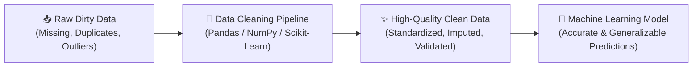

# 🧹 Data Cleaning & Preprocessing

> [!info] Navigation: [[CSTU40]] > [[Year 2]] > [[Year 2 Semester 1]] > [[CS240]] > [[Data Cleaning]]
> **Related Notes:** [[CS240]] | [[Data Science Process]] | [[Type Of Data]] | [[The Data Science]]
> **Reference:** `Private/Docs/2.Data-Acquisition.pdf` | `Private/Docs/CS240_Week1_Principle_of_Data_Science.pdf`

---

## 1. Overview & Importance of Data Cleaning

In real-world data science workflows, raw data collected from sensors, web scraping, user inputs, and transactional databases is almost universally **dirty, incomplete, redundant, and noisy**. 

> [!warning] The "Garbage In, Garbage Out" (GIGO) Principle
> Machine learning algorithms and statistical models learn patterns directly from input data. If training data contains inaccuracies, duplicate records, misaligned units, or corrupted values, the model will produce flawed predictions regardless of its complexity or architectural sophistication.

Data preparation and cleaning typically consumes **60% to 80%** of a data scientist's time and effort in the standard [[Data Science Process]] (CRISP-DM Step 3).



---

## 2. The Four Major Data Quality Anomalies

```
                           ┌───────────────────────────────────┐
                           │    Common Data Quality Issues     │
                           └───────────────────────────────────┘
                                             │
      ┌──────────────────────┬───────────────┴───────────────┬──────────────────────┐
      ▼                      ▼                               ▼                      ▼
1. Missing Data        2. Duplicate Records            3. Inconsistent Types  4. Outliers & Noise
- Null / NaN / None    - Exact row duplicates          - Numbers stored as text- Measurement errors
- Structural voids     - Semantic / Fuzzy duplicates   - Inconsistent dates   - Extreme values
```

| Anomaly Type | Root Causes | Impact on Analysis | Primary Mitigation Techniques |
| :--- | :--- | :--- | :--- |
| **Missing Values** | Dropped sensor signals, optional survey fields, API timeout failures. | Mathematical crashes in linear algebra, biased estimators. | Deletion (`dropna`), Statistical Imputation (Mean, Median, Mode), KNN / MICE. |
| **Duplicate Rows** | Network retry submissions, database merge collisions, repeated logs. | Artificially inflates sample size, leads to data leakage across train/test splits. | Exact deduplication (`drop_duplicates`), primary key constraints, fuzzy matching. |
| **Inconsistent Types & Formatting** | Mixed input formats (e.g. `2026-08-28` vs `28/08/2026`), whitespace, typo variations (`Male`, `M`, `male`). | Grouping fragmentation, inability to perform arithmetic calculations. | Explicit type casting (`astype`, `to_datetime`), regex string normalization. |
| **Outliers & Anomalies** | Data entry typos (e.g. Age = `250`), sensor spikes, genuine extreme events. | Skews Mean and Variance, destabilizes gradient descent in linear models. | IQR filtering ($1.5 	imes 	ext{IQR}$), Z-score thresholds ($|Z| > 3$), Winsorization / Capping. |

---

## 3. Handling Missing Data (Imputation vs. Deletion)

### Missingness Mechanisms

Understanding the mechanism causing missing data is critical before selecting an imputation strategy:

1. **MCAR (Missing Completely at Random):** Missingness is completely independent of both observed and unobserved data (e.g., a lab technician accidentally drops a test tube). Dropping rows introduces minimal bias.
2. **MAR (Missing at Random):** Missingness is related to other observed features in the dataset, but not the missing value itself (e.g., younger individuals are less likely to report income). Imputation using correlated features is effective.
3. **MNAR (Missing Not at Random):** Missingness depends directly on the value of the unobserved variable itself (e.g., people with severe depression skipping survey questions about mental health). Deletion causes severe bias; requires specialized modeling or domain-driven imputation.

### Missing Data Handling Strategies

```
                                  ┌─────────────────────────────┐
                                  │   Missing Data Strategies   │
                                  └─────────────────────────────┘
                                                 │
                  ┌──────────────────────────────┴──────────────────────────────┐
                  ▼                                                             ▼
         1. Deletion Methods                                           2. Imputation Methods
         ├── Listwise Deletion (Drop Row)                              ├── Univariate (Mean, Median, Mode)
         └── Feature Deletion (Drop Column)                            ├── Time Series (Forward/Backward Fill)
                                                                       └── Multivariate (KNN, MICE / Iterative)
```

#### A. Deletion (`dropna`)
Use when missing values represent $< 3-5\%$ of data and missingness is MCAR, or when a column is $> 60-70\%$ empty.

```python
import pandas as pd
import numpy as np

# 1. Identify missing values
print(df.isnull().sum())
print(df.isna().mean() * 100) # Percentage missing per column

# 2. Drop rows with ANY missing value (Listwise deletion)
df_clean = df.dropna()

# 3. Drop rows where specific critical columns are null
df_clean = df.dropna(subset=['target_variable', 'user_id'])

# 4. Drop entire columns exceeding 50% missing threshold
threshold = len(df) * 0.5
df_clean = df.dropna(thresh=threshold, axis=1)
```

#### B. Statistical & Advanced Imputation (`fillna`, `SimpleImputer`, `KNNImputer`)

```python
from sklearn.impute import SimpleImputer, KNNImputer

# --- Univariate Imputation (Pandas) ---
# For Numerical: Median is robust against skewed outliers; Mean for symmetric normal data
df['salary'] = df['salary'].fillna(df['salary'].median())

# For Categorical: Impute with Mode (most frequent value) or 'Unknown' category
df['city'] = df['city'].fillna(df['city'].mode()[0])

# For Time Series: Forward Fill (propagate last valid observation) or Interpolation
df['stock_price'] = df['stock_price'].ffill().bfill()
df['temperature'] = df['temperature'].interpolate(method='linear')

# --- Multivariate Imputation (Scikit-Learn) ---
# KNN Imputer: Uses Euclidean distance across k-nearest neighbors to estimate missing values
knn_imputer = KNNImputer(n_neighbors=5)
df_imputed_array = knn_imputer.fit_transform(df[['age', 'income', 'credit_score']])
df[['age', 'income', 'credit_score']] = df_imputed_array
```

---

## 4. Handling Duplicate Records

Duplicates occur when identical transactions, sensor signals, or user submissions are recorded multiple times.

```python
# 1. Inspect duplicate count
num_duplicates = df.duplicated().sum()
print(f"Total duplicate rows: {num_duplicates}")

# 2. View all instances of duplicate rows
duplicate_records = df[df.duplicated(keep=False)]

# 3. Remove exact full-row duplicates (keeping first occurrence)
df = df.drop_duplicates(keep='first')

# 4. Remove partial duplicates based on unique business keys
# E.g., Keep the most recent record per user_id
df = df.sort_values(by='updated_at', ascending=False)
df = df.drop_duplicates(subset=['user_id'], keep='first')
```

---

## 5. Data Type Conversion & String Standardization

Data ingested from CSV, JSON, or APIs often loads as generic `object` (string) types instead of proper numeric, boolean, or datetime representations.

```python
# 1. Numeric Type Conversion with Error Coercion
# Invalid string values (e.g. "N/A", "missing", "$1,200") become np.nan
df['price'] = df['price'].str.replace('$', '', regex=False).str.replace(',', '', regex=False)
df['price'] = pd.to_numeric(df['price'], errors='coerce')

# 2. Datetime Parsing & Timezone Normalization
df['transaction_date'] = pd.to_datetime(df['transaction_date'], format='%Y-%m-%d %H:%M:%S', errors='coerce')
df['year'] = df['transaction_date'].dt.year
df['day_of_week'] = df['transaction_date'].dt.day_name()

# 3. Categorical Type Conversion (Reduces memory usage by up to 80%)
df['membership_tier'] = df['membership_tier'].astype('category')

# 4. String Cleaning & Text Standardization
df['email'] = df['email'].str.strip().str.lower()
df['phone'] = df['phone'].str.replace(r'\D+', '', regex=True) # Keep only digits

# 5. Harmonizing Inconsistent Categorical Labels
# Mapping multiple spellings/abbreviations into a canonical set
gender_map = {
    'M': 'Male', 'm': 'Male', 'MALE': 'Male', 'man': 'Male',
    'F': 'Female', 'f': 'Female', 'FEMALE': 'Female', 'woman': 'Female'
}
df['gender'] = df['gender'].map(gender_map).fillna('Other')
```

---

## 6. Outlier Detection & Treatment

An **outlier** is an observation that deviates substantially from the overall pattern of the data distribution.

```
                  ┌───────────────────────────────────────────────────────────┐
                  │                 Outlier Detection Methods                 │
                  └───────────────────────────────────────────────────────────┘
                                                │
                 ┌──────────────────────────────┴──────────────────────────────┐
                 ▼                                                             ▼
   Parametric: Z-Score Method                                Non-Parametric: IQR Method (Boxplot)
   - Assumes Normal Gaussian Distribution                    - Robust against non-normal / skewed data
   - Threshold: $|Z| > 3.0$                                   - Lower Bound: $Q_1 - 1.5 	imes 	ext{IQR}$
   - Formula: $Z = \frac{x - \mu}{\sigma}$                   - Upper Bound: $Q_3 + 1.5 	imes 	ext{IQR}$
```

### A. Interquartile Range (IQR) Method (Recommended for Skewed Data)

$$	ext{IQR} = Q_3 - Q_1$$
$$	ext{Lower Fence} = Q_1 - 1.5 	imes 	ext{IQR}, \quad 	ext{Upper Fence} = Q_3 + 1.5 	imes 	ext{IQR}$$

```python
# Calculate Quantiles and IQR
Q1 = df['income'].quantile(0.25)
Q3 = df['income'].quantile(0.75)
IQR = Q3 - Q1

lower_fence = Q1 - 1.5 * IQR
upper_fence = Q3 + 1.5 * IQR

# 1. Filter / Trim Outliers
df_trimmed = df[(df['income'] >= lower_fence) & (df['income'] <= upper_fence)]

# 2. Winsorization / Capping (Set extreme values to threshold boundaries without dropping rows)
df['income_capped'] = np.clip(df['income'], lower_fence, upper_fence)
```

### B. Z-Score Method (For Bell-Curved / Gaussian Data)

$$Z = \frac{x - \mu}{\sigma}$$

```python
from scipy import stats

# Calculate absolute Z-scores
z_scores = np.abs(stats.zscore(df['height'].dropna()))
threshold = 3.0

# Identify and filter outliers
outliers = df[z_scores > threshold]
df_no_outliers = df[z_scores <= threshold]
```

---

## 7. End-to-End Data Cleaning Pipeline in Python

A production-grade, modular cleaning routine encapsulating all standard stages:

```python
def clean_dataset(raw_df: pd.DataFrame) -> pd.DataFrame:
    """
    Production data cleaning pipeline:
    1. Schema & Type Standardization
    2. String & Text Sanitization
    3. Duplicate Removal
    4. Missing Value Imputation
    5. Outlier Capping
    """
    df = raw_df.copy()
    
    # 1. Clean column headers (snake_case, strip whitespace)
    df.columns = df.columns.str.strip().str.lower().str.replace(' ', '_')
    
    # 2. Remove duplicate rows
    df = df.drop_duplicates()
    
    # 3. String standardization
    text_cols = df.select_dtypes(include=['object']).columns
    for col in text_cols:
        df[col] = df[col].astype(str).str.strip()
        df[col] = df[col].replace({'nan': np.nan, 'None': np.nan, '': np.nan})
        
    # 4. Impute numerical features with median
    num_cols = df.select_dtypes(include=[np.number]).columns
    for col in num_cols:
        median_val = df[col].median()
        df[col] = df[col].fillna(median_val)
        
        # Outlier Capping via IQR
        q1 = df[col].quantile(0.25)
        q3 = df[col].quantile(0.75)
        iqr = q3 - q1
        lower = q1 - 1.5 * iqr
        upper = q3 + 1.5 * iqr
        df[col] = np.clip(df[col], lower, upper)
        
    # 5. Impute categorical features with mode
    cat_cols = df.select_dtypes(include=['object', 'category']).columns
    for col in cat_cols:
        if df[col].isnull().sum() > 0:
            df[col] = df[col].fillna(df[col].mode()[0])
            
    return df
```

---

# Categorical Attributes

One that has a set-valued domain composed of a set of symbols. Such as Gender = {M,F}, Education = {High School, BS, MS, PhD}, etc.

> [!faq] Most of Machine learning algorithms can not handle categorical variables.

To manage the categorical attributes, do convert data to number or numerical data.

## Encoding of Categorical Dat

Map each category to a vector that contains 1 ( presence of the feature ) and 0 ( absence of the feature )

### Nominal variable 

- One-hot encoding is where you represent each possible value for a category as a separate feature. 
- Map each category to a vector that contains 1 (presence of the feature) and 0 (absence of the feature )

| Gender | isMale | isFemale | isOther |
| ------ | ------ | -------- | ------- |
| Male   | 1      | 0        | 0       |
| Female | 0      | 1        | 0       |
| Other  | 0      | 0        | 1       |

### Ordinal encoding

- The encoding of variables retains the ordinal nature of the variable
- Each category is assigned a value from 1 through the number of possible values by considering the order of values.

| Feeling  | Temporator |
| -------- | ---------- |
| Cold     | 1          |
| Warm     | 2          |
| Hot      | 3          |
| Very Hot | 4          |

---
## Why Is Data Quality Important?

When collected data fails to meet the company expectations of **accuracy, validity, completeness, and consistency**, it can have ==massive negative impacts== on customer service, employee productivity, and key strategies.

By tracking data quality, a business can ==pinpoint potential issues harming quality==, and ensure that shared data is fit to be used for a given purpose.

The quality of data is determined by factors such as accuracy, completeness, reliability, relevance and how ==up to date== it is.

> [!note] The Data Should Be
> - **Accurate** and Precise 
> - **Complete** — Does not have "unknown" or "missing" values
> - **Consistency** — Two data items in the data set contradict each other 
> - **Valid** — Conform to defined business rules or constraints 
> - **Uniform** — Using the same units of measure in all systems 
> - **Unique** — Does not contain duplicates

---

## 8. Summary Checklist for Clean Data

> [!check] Data Validation Heuristics (Ready for Machine Learning):
> - [x] **No Unexpected Nulls:** All critical features have missing values handled appropriately.
> - [x] **Unique Records:** Primary business keys and exact row duplicates are resolved.
> - [x] **Strict Data Types:** Numbers are `int`/`float`, dates are `datetime64`, categories are `category`.
> - [x] **Valid Ranges & Constraints:** Numerical values adhere to physical bounds (e.g. $0 \le 	ext{Age} \le 120$, $	ext{Price} \ge 0$).
> - [x] **Consistent Categories:** Text encodings are uniform without spelling variations.
> - [x] **Distribution Stability:** Destabilizing extreme outliers are capped or investigated.

---

## 🔗 Related Notes & Course References
- [[CS240]] — Main Course Index for Data Science
- [[The Data Science]] — Foundational concepts, DIKW hierarchy, and analytics maturity
- [[Data Science Process]] — Full 7-stage CRISP-DM lifecycle
- [[Type Of Data]] — Measurement scales (Nominal, Ordinal, Interval, Ratio) and data structures
- [[ST329]] — Statistics for Data Science and Probability Distributions
