# 📐 UML Diagrams & Mermaid Syntax Complete Reference

> [!info] Navigation: [[CSTU40]] > [[Year 2]] > [[Year 2 Semester 1]] > [[CS261]] > [[Diagram]]
> **Related Notes:** [[CS261]] \| [[Introduction to Software Engineering]] \| [[Software Process]] \| [[System Engineer]] \| [[Cost of Development]]

---

## 1. Overview of UML (Unified Modeling Language)

The **Unified Modeling Language (UML)** is an ISO/IEC and OMG (Object Management Group) standard visual modeling language used in software engineering to **specify**, **visualize**, **construct**, and **document** the artifacts of object-oriented software-intensive systems.

```
                                 ┌───────────────────────────────┐
                                 │       UML 2.5 Diagrams        │
                                 │         (14 Diagrams)         │
                                 └───────────────────────────────┘
                                                 │
                  ┌──────────────────────────────┴──────────────────────────────┐
                  ▼                                                             ▼
   ┌──────────────────────────────┐                              ┌──────────────────────────────┐
   │     Structural Diagrams      │                              │     Behavioral Diagrams      │
   │      (Static Structure)      │                              │      (Dynamic Behavior)      │
   │         (7 Diagrams)         │                              │         (7 Diagrams)         │
   └──────────────────────────────┘                              └──────────────────────────────┘
                  │                                                             │
    ├── 1. Class Diagram                                          ├── 8. Use Case Diagram
    ├── 2. Object Diagram                                         ├── 9. Activity Diagram
    ├── 3. Package Diagram                                        ├── 10. State Machine Diagram
    ├── 4. Component Diagram                                      └── 11. Interaction Diagrams
    ├── 5. Deployment Diagram                                           ├── 11a. Sequence Diagram
    ├── 6. Composite Structure Diagram                                  ├── 11b. Communication Diagram
    └── 7. Profile Diagram                                              ├── 11c. Timing Diagram
                                                                        └── 11d. Interaction Overview
```

> [!abstract] Core Purposes of UML in Software Engineering:
> 1. **Communication:** Serves as a universal lingua franca bridging business analysts, architects, software engineers, and QA teams.
> 2. **Abstraction & Architectural Blueprint:** Allows modeling complex distributed systems without getting entangled in low-level language syntax.
> 3. **Validation & Verification:** Validates requirements, edge-case lifecycles, and system states before writing production code.
> 4. **Forward & Reverse Engineering:** Facilitates generating code skeleton from diagrams and reverse-documenting existing systems.

---

## 2. Classification Matrix: Structural vs. Behavioral

| Category | Diagram Name | Primary Focus / Objective | Mermaid Opener |
| :--- | :--- | :--- | :--- |
| **Structural** | **1. Class Diagram** | Static structure of classes, attributes, methods, and relationships. | `classDiagram` |
| **Structural** | **2. Object Diagram** | Snapshot of object instances and runtime values at a specific instant $t_0$. | `classDiagram` / `flowchart TD` |
| **Structural** | **3. Package Diagram** | Grouping of classes into namespaces, subsystems, and architectural layers. | `flowchart TD` (subgraphs) |
| **Structural** | **4. Component Diagram** | Modular components, provided/required interfaces (lollipops/sockets). | `flowchart TD` / `flowchart LR` |
| **Structural** | **5. Deployment Diagram** | Physical hardware nodes, virtual environments, containers, and network links. | `flowchart TD` (subgraphs) |
| **Structural** | **6. Composite Structure** | Internal decomposition of a classifier, including ports, parts, and connectors. | `flowchart LR` (subgraphs) |
| **Structural** | **7. Profile Diagram** | Metamodel customization via stereotypes (`<<...>>`), tagged values, constraints. | `classDiagram` / `flowchart TD` |
| **Behavioral** | **8. Use Case Diagram** | User goals, system boundary, actors, and functional scopes (`include`/`extend`). | `flowchart LR` (subgraphs) |
| **Behavioral** | **9. Activity Diagram** | Step-by-step procedural workflow, concurrency forks/joins, and swimlanes. | `flowchart TD` / `flowchart LR` |
| **Behavioral** | **10. State Machine Diagram** | Finite states, event triggers, guards, actions, and lifecycle transitions. | `stateDiagram-v2` |
| **Behavioral** | **11. Sequence Diagram** | Chronological, time-ordered message interchange between lifelines. | `sequenceDiagram` |
| **Behavioral** | **12. Communication Diagram** | Object interactions focused on architectural link topology and numbered messages. | `flowchart TD` |
| **Behavioral** | **13. Timing Diagram** | State/value transitions plotted against a continuous, linear time scale. | `gantt` / `flowchart LR` |
| **Behavioral** | **14. Interaction Overview** | High-level macro workflow containing embedded sequence/interaction frames. | `flowchart TD` (subgraphs) |

---

# Part I: Structural UML Diagrams (ไดอะแกรมเชิงโครงสร้าง)

---

### 1. Class Diagram (คลาสไดอะแกรม)

> [!info] Concept & Purpose
> The **Class Diagram** is the cornerstone of object-oriented modeling. It models the static structure of a system by showing the system's classes, their attributes, operations (methods), visibility, and the relationships among objects.

#### Key Notations & Relationships
- **Visibility Modifiers:** `+` (Public), `-` (Private), `#` (Protected), `~` (Package/Default).
- **Inheritance / Generalization (`<|--`):** Child class inherits from parent class (`Is-a`).
- **Realization / Implementation (`<|..`):** Concrete class implements interface contract.
- **Composition (`*--`):** Strong whole-part relationship where parts **cannot exist** without the whole (owned lifecycle).
- **Aggregation (`o--`):** Weak whole-part relationship where parts **can exist** independently.
- **Association (`-->` or `--`):** General semantic relationship between two classes.
- **Dependency (`..>`):** Temporary usage where class A depends on class B (e.g. method parameter).

#### Mermaid Syntax & Implementation

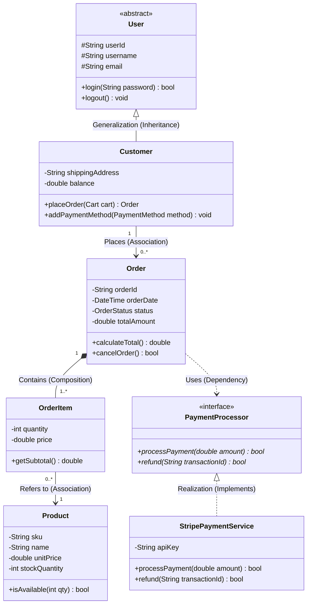

---

### 2. Object Diagram (ออบเจกต์ไดอะแกรม)

> [!info] Concept & Purpose
> An **Object Diagram** represents a static snapshot of the system's runtime state at a specific moment in time ($t = t_0$). It instantiates classes into concrete objects, shows specific attribute values, and depicts the actual links connecting those instances.

#### Key Notations
- **Object Notation:** `instanceName : ClassName` or `: ClassName` (anonymous instance).
- **Underlined Name:** Indicates an instantiated entity.
- **State Values:** `attribute = value` (e.g., `status = "Paid"`).

#### Mermaid Syntax & Implementation

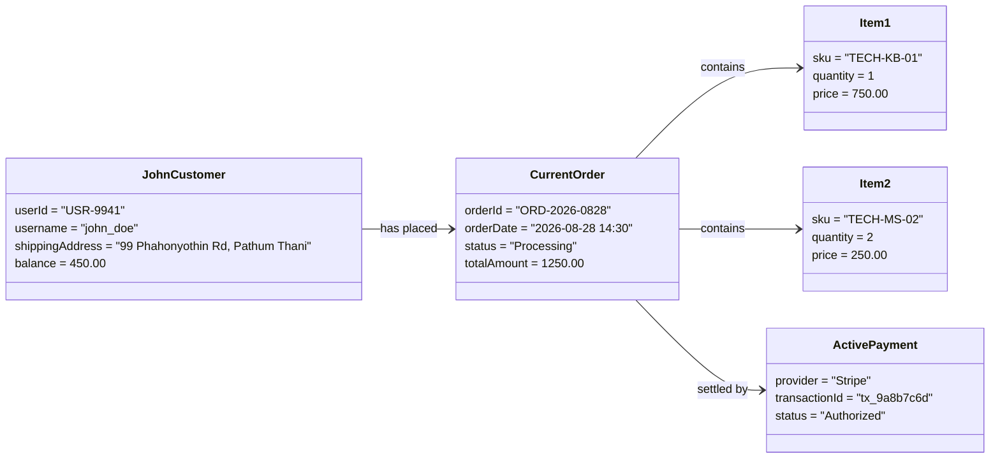

---

### 3. Package Diagram (แพ็กเกจไดอะแกรม)

> [!info] Concept & Purpose
> A **Package Diagram** organizes the system's structural elements into logical groups, folders, namespaces, or layers. It highlights architectural boundaries, subsystem hierarchies, and dependencies (`<<use>>`, `<<import>>`, `<<access>>`) across Clean Architecture or Layered Architecture tiers.

#### Key Notations
- **Package Box:** Folder icon with a tab containing the package name.
- **Dependency Arrow (`..>`):** Indicates that elements in one package rely on elements in another.
- **Architectural Rules:** Top-down layered dependency without cyclic dependencies ($A 	o B 	o C$).

#### Mermaid Syntax & Implementation

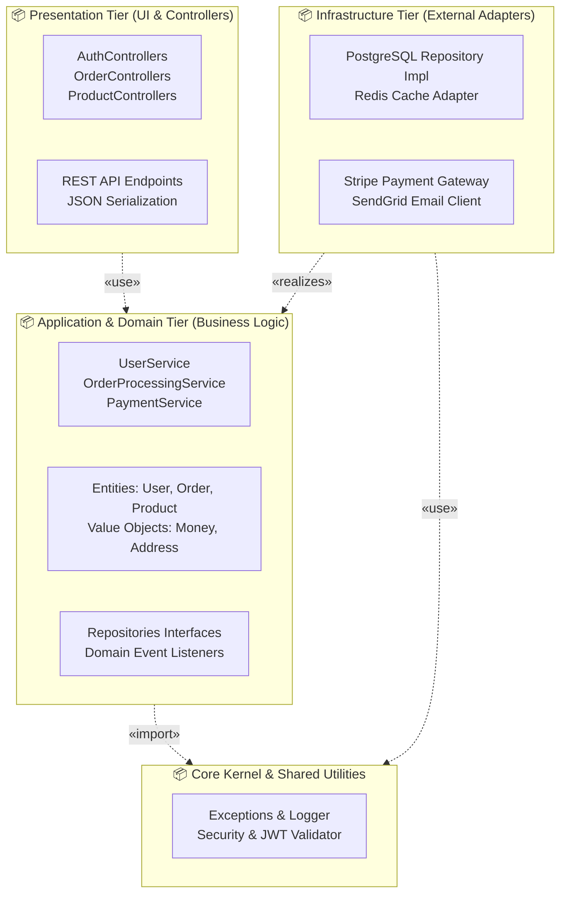

---

### 4. Component Diagram (คอมโพเนนต์ไดอะแกรม)

> [!info] Concept & Purpose
> A **Component Diagram** describes the organization and wiring of modular, replaceable software units (components). It models high-level service interfaces using **Provided Interfaces** (Lollipops / what the component offers) and **Required Interfaces** (Sockets / what the component needs from others).

#### Key Notations
- **Component Box:** Stereotyped as `«component»`.
- **Provided Interface:** Open circle on a stick (`-O-`) representing services supplied to consumers.
- **Required Interface:** Half-circle socket (`-( `) representing services consumed from external components.
- **Port:** Small square representing an explicit interaction gateway.

#### Mermaid Syntax & Implementation

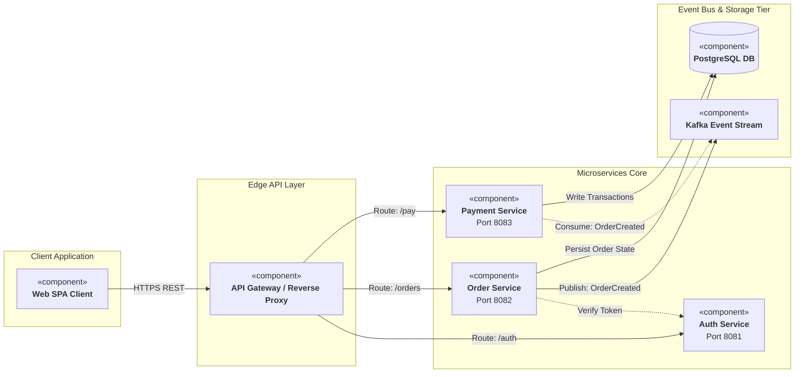

---

### 5. Deployment Diagram (ดีพลอยเมนต์ไดอะแกรม)

> [!info] Concept & Purpose
> A **Deployment Diagram** models the physical or virtual computing hardware architecture, network topology, runtime execution environments (Kubernetes, JVM, Docker), and the concrete software **artifacts** (`.jar`, `.dockerfile`, `.war`, `.exe`) deployed onto them.

#### Key Notations
- **Node (3D Box):** Physical machine, VM, or cloud server (`«device»` or `«executionEnvironment»`).
- **Artifact:** Software binary or configuration bundle (`«artifact» app.jar`).
- **Communication Path:** Solid line labeled with protocols (`TCP/IP`, `HTTPS`, `gRPC`, `AMQP`).

#### Mermaid Syntax & Implementation

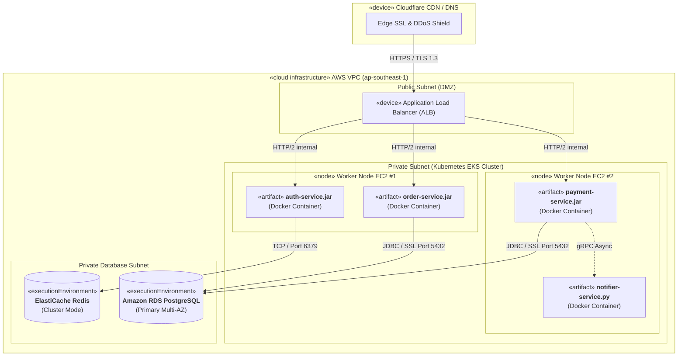

---

### 6. Composite Structure Diagram (คอมโพสิตสตรัคเจอร์ไดอะแกรม)

> [!info] Concept & Purpose
> A **Composite Structure Diagram** looks *inside* a complex classifier or system component to depict its internal structural decomposition. It details internal **parts**, **ports** (interaction endpoints), **connectors**, and collaborating roles that collaborate during runtime execution.

#### Key Notations
- **Port (`p1`):** A distinct interaction point between the classifier and its external environment.
- **Part:** Internal structural role or subsystem instance within the classifier.
- **Connector:** Communication line connecting internal parts or routing ports to internal parts.

#### Mermaid Syntax & Implementation

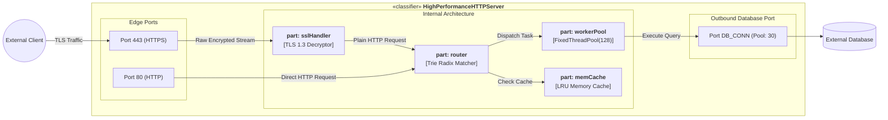

---

### 7. Profile Diagram (โพรไฟล์ไดอะแกรม)

> [!info] Concept & Purpose
> A **Profile Diagram** provides an extension mechanism for customizing standard UML metamodels for specific domains, architectural platforms, or programming frameworks (e.g., Spring Boot, Java Enterprise, Embedded Real-Time systems, Cloud-Native Microservices).

#### Key Notations
- **Stereotype (`«stereotype»`):** An extension element that customizes a standard UML metaclass.
- **Metaclass (`«metaclass»`):** The foundational UML element being extended (e.g., `Class`, `Property`, `Component`).
- **Tagged Values / Attributes:** Domain-specific configuration metadata.
- **Extension Link (`«extension»` with filled triangle):** Arrow pointing from the Stereotype to the Base Metaclass.

#### Mermaid Syntax & Implementation

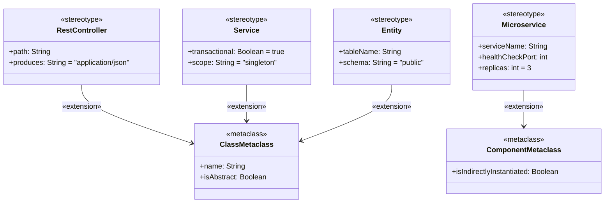

---

# Part II: Behavioral UML Diagrams (ไดอะแกรมเชิงพฤติกรรม)

---

### 8. Use Case Diagram (ยูสเคสไดอะแกรม)

> [!info] Concept & Purpose
> A **Use Case Diagram** captures the functional requirements of a system from the perspective of external actors. It depicts the system boundary, primary/secondary actors, and use cases (system capabilities), highlighting inclusion and extension relationships.

#### Key Notations & Rules
- **Actor:** Stick figure or box representing human users, external systems, or time triggers.
- **Use Case:** Oval representing a distinct, measurable goal delivered by the system.
- **System Boundary:** Box enclosing all use cases belonging to the system.
- **`«include»`:** Mandatory subroutine; Base use case **always** executes the included use case (Directed arrow $	o$ Included).
- **`«extend»`:** Optional behavior; Extension use case executes only under specific conditional extension points (Directed arrow $	o$ Base).

#### Mermaid Syntax & Implementation

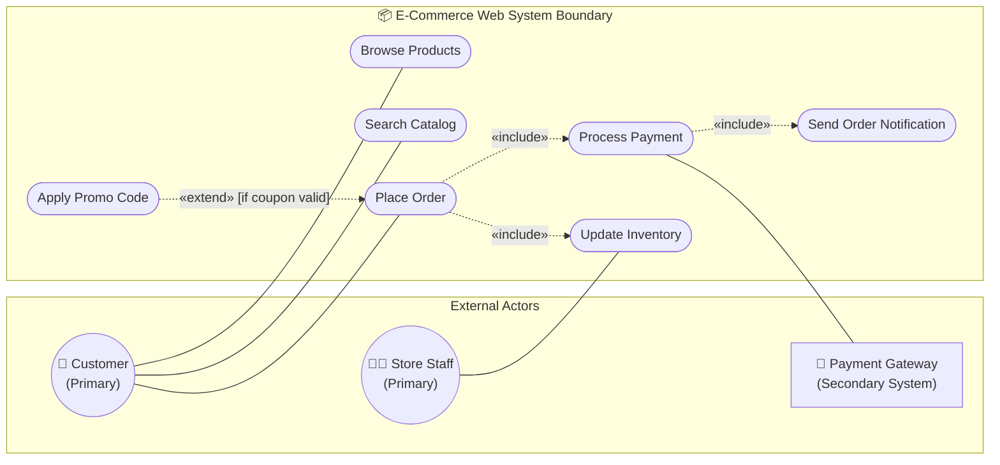

---

### 9. Activity Diagram (แอคทิวิตีไดอะแกรม)

> [!info] Concept & Purpose
> An **Activity Diagram** models procedural workflows, business logic, algorithmic control flows, and data transitions. It natively supports **parallel processing** (Forks and Joins) and **Swimlanes** (partitioning responsibilities across organizational roles or microservices).

#### Key Notations
- **Initial Node (`((●))`):** Starting point of the activity workflow.
- **Final Activity Node (`((◎))`):** Complete termination of the entire workflow.
- **Decision Diamond (`{?}`):** Conditional branching with mutually exclusive guard conditions (`[Yes]`, `[No]`).
- **Merge Node (`{ }`):** Re-convergence of multiple conditional paths without synchronization.
- **Fork Bar (`===`):** Single control flow splits into two or more concurrent, parallel threads.
- **Join Bar (`===`):** Synchronizes multiple parallel threads before proceeding.

#### Mermaid Syntax & Implementation

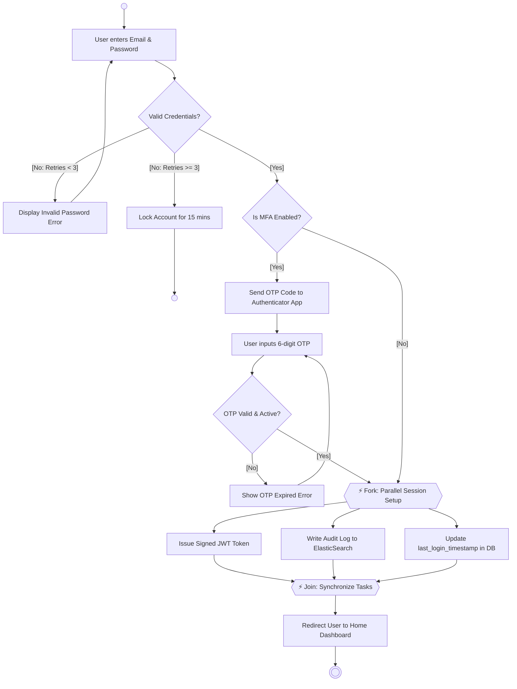

---

### 10. State Machine / State Diagram (สเตตไดอะแกรม)

> [!info] Concept & Purpose
> A **State Machine Diagram** (Statechart) models the dynamic lifecycle of a single object or finite state machine (FSM). It illustrates the discrete states an entity undergoes in response to external events, guard conditions, and internal actions.

#### Key Notations & Syntax
- **Initial State (`[*]`):** Entry point of the state machine.
- **Final State (`[*]`):** Terminal state when the object lifecycle ceases.
- **Transition Syntax:** `SourceState --> TargetState : EventTrigger [GuardCondition] / ActionEffect`
- **Composite State:** A nested super-state containing inner sub-states.

#### Mermaid Syntax & Implementation

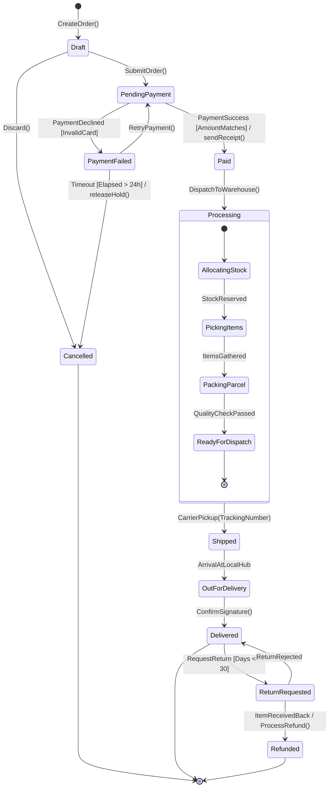

---

### 11. Sequence Diagram (ซีเควนซ์ไดอะแกรม)

> [!info] Concept & Purpose
> A **Sequence Diagram** is the most widely utilized interaction diagram. It models object interactions arranged in strict **chronological time sequence**. It emphasizes the vertical progression of time and the horizontal messages passed between collaborating lifelines.

#### Key Notations & Operators
- **Lifeline:** Vertical dashed line representing the existence of an object over time.
- **Activation Bar:** Vertical rectangle indicating when an object is actively executing a task.
- **Message Types:**
  - `->>` : Synchronous call (caller blocks waiting for response).
  - `-->>` : Return message (response payload).
  - `-)` : Asynchronous message (caller continues without blocking).
- **Interaction Combined Fragments:**
  - `alt ... else ... end` : Alternative conditional execution.
  - `opt ... end` : Optional execution (if condition is true).
  - `loop ... end` : Repeated iteration.
  - `par ... and ... end` : Parallel concurrent threads.
  - `critical ... end` : Atomic transaction (critical section).

#### Mermaid Syntax & Implementation

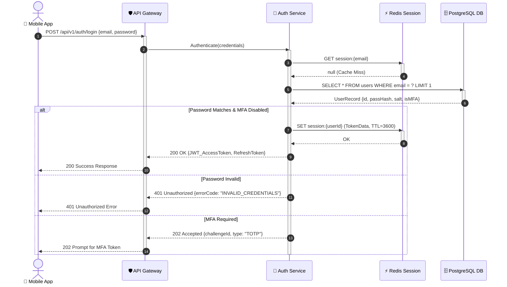

---

### 12. Communication Diagram (คอมมิวนิเคชันไดอะแกรม)

> [!info] Concept & Purpose
> Formerly known as a **Collaboration Diagram** in UML 1.x, the **Communication Diagram** focuses on the **structural organization and architecture** of collaborating objects rather than pure time progression. Message sequencing is shown explicitly via **hierarchically numbered decimal labels** ($1, 1.1, 1.2, 2, ...$).

#### Key Notations & Numbering Conventions
- **Solid Links:** Structural communication paths between objects.
- **Numbered Messages:** E.g., `1: Request`, `1.1: Nested sub-call`, `1.2: Follow-up sub-call`, `2: Next sequential step`.
- **Directional Arrow:** Indicates the sender and recipient of each message.

#### Mermaid Syntax & Implementation

```mermaid
flowchart TD
    Client["👤 <b>Client (User)</b>"]
    Controller["⚙️ <b>:OrderController</b>"]
    OrderService["📦 <b>:OrderService</b>"]
    Inventory["🏭 <b>:InventoryManager</b>"]
    PaymentGateway["💳 <b>:PaymentGateway</b>"]
    Notification["🔔 <b>:EmailNotifier</b>"]

    Client -->|1. submitOrder(cart)| Controller
    Controller -->|1.1. processOrder(cart)| OrderService

    OrderService -->|1.1.1. reserveItems(itemList)| Inventory
    Inventory -- "1.1.1.1. confirmReservation()" --> OrderService

    OrderService -->|1.1.2. chargeCreditCard(amount)| PaymentGateway
    PaymentGateway -- "1.1.2.1. paymentApproved(txId)" --> OrderService

    OrderService -->|1.1.3. dispatchOrderReceipt()| Notification
    OrderService -- "1.2. orderSuccess(ORD-991)" --> Controller
    Controller -- "2. displayOrderSummary()" --> Client
```

---

### 13. Timing Diagram (ไทม์มิ่งไดอะแกรม)

> [!info] Concept & Purpose
> A **Timing Diagram** is a specialized interaction diagram used in real-time embedded systems, hardware design, and protocol verification. It models the **exact state changes and value conditions** of one or more lifelines along a continuous, quantitative **timeline scale** with strict duration and latency constraints.

#### Key Notations
- **State Timeline:** Horizontal waveform/line transitioning between discrete states (e.g. *Idle $	o$ Reading $	o$ Processing*).
- **Time Axis:** Quantitative scale marked in seconds, milliseconds ($	ext{ms}$), or clock cycles.
- **Timing Constraints:** Max/min duration limits (e.g., $t_{	ext{response}} < 50	ext{ms}$).

#### Mermaid Syntax & Implementation

```mermaid
gantt
    title Hardware / Software Door Access Controller Timing Lifecycle
    dateFormat X
    axisFormat %s sec

    section Sensor Hardware
    Laser Proximity Sensor (Idle)        :0, 2
    Proximity Triggered (Active High)   :active, 2, 5
    Sensor Reset to Standby             :5, 12

    section RFID Reader Firmware
    Standby Polling Mode                :0, 2
    Reading SmartCard RFID Payload       :crit, 2, 4
    Validating Payload Cryptography     :4, 5
    Card Removed (Idle Mode)            :5, 12

    section Microcontroller Logic
    MCU in Sleep Mode                   :0, 2
    Wakeup Interrupt & Decrypt Token    :crit, 2, 5
    Authorize Relay & Trigger Solenoid  :5, 9
    Relock Timeout & Power Down         :9, 12

    section Physical Solenoid Lock
    Bolt Locked (State = CLOSED)        :0, 5
    Motor Unlocked (State = OPEN)       :active, 5, 9
    Bolt Re-Engaged (State = LOCKED)    :9, 12
```

---

### 14. Interaction Overview Diagram (อินเทอร์แอคชันโอเวอร์วิวไดอะแกรม)

> [!info] Concept & Purpose
> An **Interaction Overview Diagram** provides a high-level macro view of system interactions by marrying the control-flow structure of an **Activity Diagram** with embedded **Interaction Frames** (miniature Sequence or Communication diagrams nested inside activity nodes).

#### Key Notations
- **Activity Control Nodes:** Initial node, decisions, forks, joins, merge points.
- **Interaction Use / Frame (`ref`):** A box referencing or containing a detailed sequence diagram.
- **Branching Decision:** Determines which macro interaction scenario executes.

#### Mermaid Syntax & Implementation

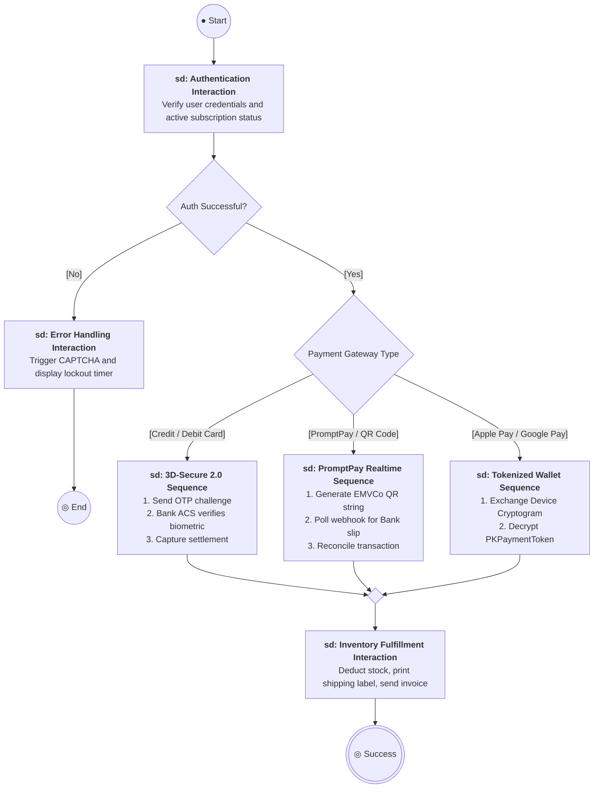

---

# 🚀 Bonus: Entity-Relationship Diagram (ERD) for Software Engineering

> [!tip] Practical Relevance in SE
> While the ER Diagram is formally an ISO/IEC database standard rather than a pure UML 2.5 diagram, it is universally used alongside UML Class Diagrams to bridge **Object-Oriented Domain Entities** with **Relational Database Schemas (RDBMS)**.

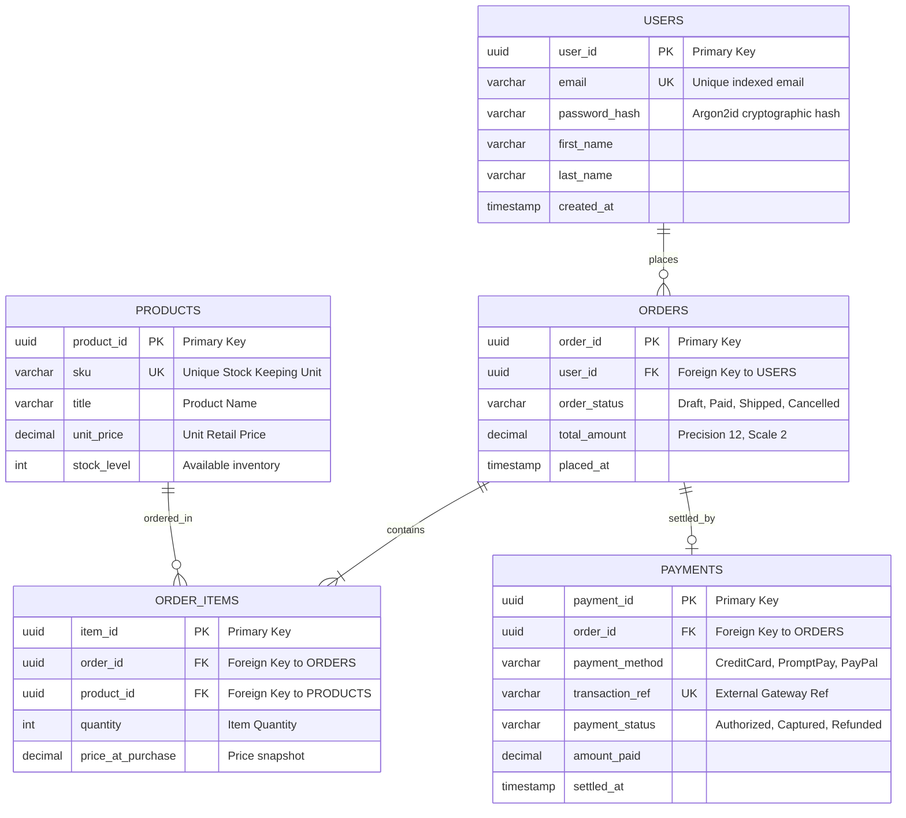

---

## 3. Master UML Selection & Decision Matrix

When designing software architectures, use this quick-reference selection guide to pick the right diagram for each software lifecycle phase:

```
                            ┌───────────────────────────────┐
                            │    What are you modeling?     │
                            └───────────────────────────────┘
                                            │
     ┌──────────────────────┬───────────────┴───────────────┬──────────────────────┐
     ▼                      ▼                               ▼                      ▼
1. System Scope &      2. Class Structures &           3. Dynamic Flows &     4. Hardware & Cloud
   User Requirements      Database Schemas                State Transitions       Infrastructure
   - Use Case Diagram     - Class Diagram                 - Sequence Diagram      - Deployment Diagram
   - Activity Diagram     - ER Diagram                    - State Diagram         - Component Diagram
                          - Object Diagram                - Activity Diagram
```

| Modeling Question | Primary UML Diagram | Alternative / Complementary |
| :--- | :--- | :--- |
| *Who uses the system and what are the major functional goals?* | **Use Case Diagram** | User Story Mapping |
| *What are the object-oriented classes, attributes, and relationships?* | **Class Diagram** | Package Diagram |
| *How do classes map into database tables and foreign keys?* | **ER Diagram (ERD)** | Class Diagram |
| *What is the exact chronological message sequence between services?* | **Sequence Diagram** | Communication Diagram |
| *What states does an entity transition through during its lifecycle?* | **State Machine Diagram** | Activity Diagram |
| *What is the complex business logic or multi-role approval workflow?* | **Activity Diagram** | Sequence Diagram |
| *How are microservice containers mapped across cloud servers and VPCs?* | **Deployment Diagram** | Component Diagram |
| *How are code modules grouped into layers and packages?* | **Package Diagram** | Composite Structure Diagram |
| *What are the runtime objects and variable values at instant $t$?* | **Object Diagram** | Class Diagram |
| *What are the strict real-time hardware latencies and signal timing?* | **Timing Diagram** | Sequence Diagram |

---

## 🔗 Related Notes & Course References
- [[CS261]] — Main Course Index for Software Engineering
- [[Introduction to Software Engineering]] — Foundational principles and 3 dimensions of SE
- [[Software Process]] — Process models, Waterfall, Spiral, and Agile Scrum sprints
- [[System Engineer]] — 7-Stage system engineering lifecycle and component decomposition
- [[Cost of Development]] — Total Cost of Ownership and maintenance breakdown
