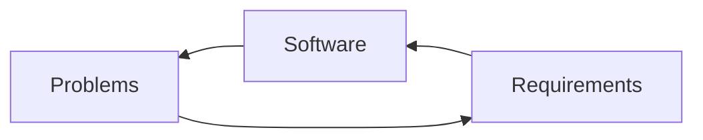

# Software Engineering Process

Is a group of operation hierarchy, to develop or maintain software system reach the target.
Must contain all of efficiency, high quality, relatable, and useable.

## Recommendation for control risks in a Project

1. **Quality Management** Control software development keep in scopes.
2. **Resource Management** Put right job in a right man. Most efficient in using resource.
3. **Time Management** Schedule, Milestone and Work Breakdown Structure.
4. **Risks and Issues Management** 

## Software Projects

To response the customer's requirements, must following **Bespoke Software Projects** which is the most popular in today works.

Next is **COTS(Commercial of-the-shelf Software Projects)** like DIYs, you just bring some part from that those or these together(or create a new one) to produce a software. the one most of pros from this method is the project would be followed standard.

>[!tip] Split a Big Project into a lot of small projects, to increase success chance.
