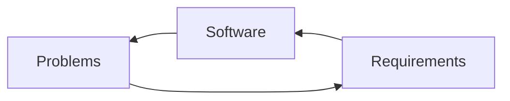

# ⚙️ Software Engineering Process

> [!info] Navigation: [[CSTU40]] > [[Year 2]] > [[Year 2 Semester 1]] > [[CS261]] > [[Software Process]]
> **Related Notes:** [[Introduction to Software Engineering]] | [[Classified Software]] | [[Cost of Development]] | [[System Engineer]] | [[CS261]]

---

## 1. Process Definition
A **Software Engineering Process** is a structured group of operational hierarchies designed to develop or maintain a software system to reach target objectives. It must ensure:
- **Efficiency:** Optimized development workflows and resource utilization.
- **High Quality:** Rigorous adherence to standards and defect minimization.
- **Relatable & Usable:** Meeting real end-user expectations and usability standards.

---

## 2. Recommendations for Controlling Risks in a Project

1. **Quality Management:** Control software development to stay strictly within defined functional and non-functional scopes.
2. **Resource Management:** Put the right person in the right job; maximize efficiency in utilizing human and infrastructure resources.
3. **Time Management:** Establish realistic schedules, milestones, and a clear Work Breakdown Structure (WBS).
4. **Risks and Issues Management:** Proactively identify, assess, and mitigate project risks before they become critical blockers.

---

## 3. Software Project Dynamics & Models

To respond to customer requirements, projects typically follow one of these paradigms:

- **Bespoke Software Projects:** Custom software engineered from scratch to fulfill specific client requirements (the most prevalent approach in contemporary practice).
- **COTS (Commercial Off-The-Shelf Software Projects):** Assembling pre-built, standardized commercial components (or integrating custom modules) to produce a software solution. A primary benefit of COTS is immediate conformance to established industry standards.

> [!tip] **Project Decomposition:**
> Split a big project into multiple small sub-projects to significantly increase the overall chance of success.
