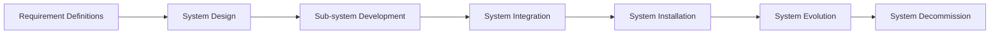

# System Engineer

The system engineering compound with:
1. Purpose of system definitions
2. Frame of system definitions
3. Split system into multi partition by its properties or functions usage
4. Considers relative between each components
5. IO, process and result definitions

## Methods

