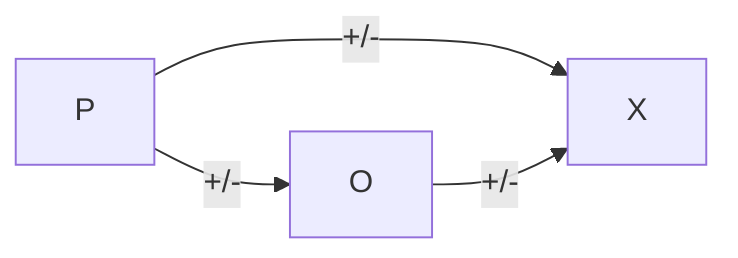

# แรงดึงดูดระหว่างบุคคล
<small>Proximity</small>

> [!faq] คนเราอยู่ๆจะเป็นเพื่อนกันได้มันไม่ได้มีเวทมนต์อะไร

มีการศึกษาเกี่ยวกับแนวโน้มของการเป็นเพื่อนจากความพี่ของการพบเจอ โดยเรา==มักมีแนวโน้มที่เข้ากันได้กับคนที่คุ้นเคย== หรือเจอบ่อยกว่า โดยมีสถานที่เป็นปัจจัยสำคัญ

แต่ก็ไม่ใช่ในทุกการเจอบ่อยๆ จะทำให้รู้สึกดี แต่มันจะเกิดจากความรู้สึกตั้งต้นว่าเป็นอย่างไร

## ความคล้าย ความเหมือนต่อความสัมพันธ์
<small>Similarity</small>

ความเหมือนเป็น **“เชื้อเพลิง”** ที่ทําให้ความสัมพันธ์พัฒนา นอกเหนือจากความใกล้ชิด โดยความเหมือนนั้นไม่ใช่ความเหมือนทางการภาพ แต่เป็นความเหมือนทางความคิดที่ทำให้คนรู้สึกร่วมกันว่าคนคนนั้นเหมือนกันกับเรา

Also เรายังชอบคนที่เหมือนกับตัวตนในอุดมคติของเราอีกด้วย
Halo Effect คนเรามักจะเชื่อมโยงความเก่ง (อะไรที่เป็นบวก) เข้ากับความดี (ธงเขียว)

## Balance Model

**Balance model ประกอบด้วย** 

- The person (P) 
- The other person (O) 
- Object or idea (X)
