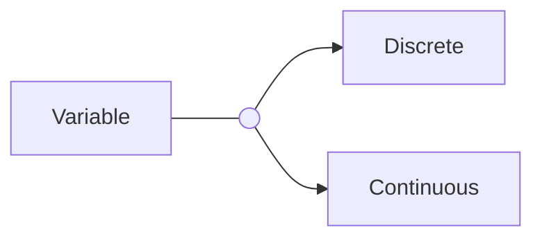

# Random Variables

$X: S \to R$
$S = \{a_1, a_2, ..., a_n\}$
$a_1 \in S$

## Discrete 

1. $x = x_1, x_2, ..., x_n \to (x_1, x_2, ..., x_n)$
2. prob mass function: $(pmf)$ $f(x) = P(X=x)$
	1. when $f(x) \geq 0$, $\sum_x f(x) = 1$
3. $P(X) \in c = \sum_{X \in c} f(x)$
4. Collective dens function: $(cdf)$
	1. $F(x) = P(X \leq x)$
			$= \sum_{t \leq x} f(t)$
5. Expected Val(to find median): $E(X)$ from $\bar{x} = \frac{x_1 + x_2 + ... + x_n}{n}$
	1. $E(X) = \sum_x xf(x)$
6. Variability: $Var(X) = E(X^2)-E^2(X)$ is $E[(X - E(X))^2]$ aka. error
## Continuous

1. $a<x<b, x>0, ...$
2. prob dens function: $(pdf)$ $f(x)$
	1. when $f(x) \geq 0$, $\int_{-\infty}^{\infty} f(x)dx = 1$
	2. use calculus
3. $P(a \leq X \leq b) = \int_a^b f(x)dx$
4. Collective dens function: $(cdf)$
	1. $F(x) = P(X \leq x)$
	2. $f(x)$ = $\int_{- \infty}^x f(t)dt$
5. Expected Val: $E(X) = \int_{-\infty}^{\infty}xf(x)dx$
6. Variablility: $Var(X) = E(X^2) - E^2(X)$
