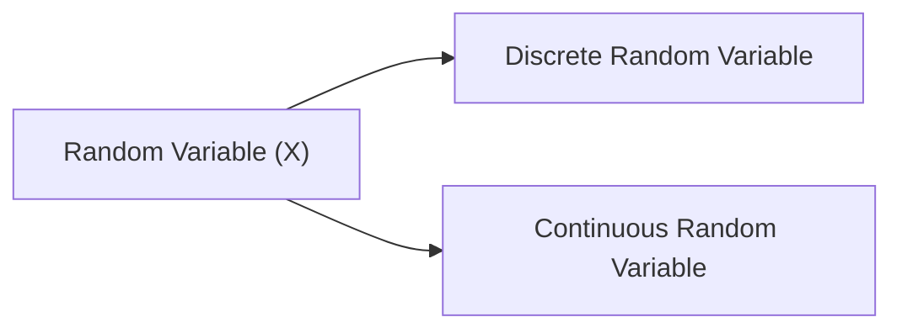

# 🎲 Random Variables

> [!info] Navigation: [[CSTU40]] > [[Year 2]] > [[Year 2 Semester 1]] > [[ST329]] > [[Random Variables]]
> **Related Notes:** [[Formulae]] | [[ST329]] | [[CS240]]

---

## 1. Definition of a Random Variable
A **Random Variable** $X$ is a function that maps outcomes from a sample space $S$ to real numbers $\mathbb{R}$:
$$
X: S 	o \mathbb{R}, \quad 	ext{where } S = \{a_1, a_2, \dots, a_n\} 	ext{ and } a_i \in S
$$

To determine which one is discrete or continuous, we can consider by
- if set of X is the countable data such $\{1, 2, ..., n\} \in N$ so it is **discrete** 
- if set of X is the uncountable data such $[1, \infty] \in R$ 

---

## 2. Discrete Random Variables

For a countable set of distinct outcomes $x \in \{x_1, x_2, \dots, x_n\}$:

1. **Probability Mass Function (PMF):** $f(x) = P(X = x)$
   - $f(x) \geq 0$ for all $x$
   - $\sum_x f(x) = 1$
2. **Event Probability:** $P(X \in C) = \sum_{x \in C} f(x)$
3. **Cumulative Distribution Function (CDF):**
   $$
   F(x) = P(X \leq x) = \sum_{t \leq x} f(t)
   $$
4. **Expected Value (Mean):**
	Or Prediction value
   $$
   E(X) = \mu = \sum_x x f(x)
   $$
5. **Variance & Error Dispersion:**
	Distant between $X$ and $x$
   $$
   \operatorname{Var}(X) = \sigma^2 = E[(X - E(X))^2] = E(X^2) - [E(X)]^2
   $$

---

## 3. Continuous Random Variables

For variables taking values on a continuous interval $(a < x < b 	ext{ or } x \in \mathbb{R})$:

1. **Probability Density Function (PDF):** $f(x)$
   - $f(x) \geq 0$ for all $x \in \mathbb{R}$
   - $\int_{-\infty}^{\infty} f(x) \, dx = 1$
2. **Interval Probability:**
   $$
   P(a \leq X \leq b) = \int_a^b f(x) \, dx
   $$
3. **Cumulative Distribution Function (CDF):**
   $$
   F(x) = P(X \leq x) = \int_{-\infty}^x f(t) \, dt
   $$
   *(Note: By Fundamental Theorem of Calculus, $f(x) = \frac{d}{dx}F(x)$)*
4. **Expected Value (Mean):**
	Or Prediction value
   $$
   E(X) = \mu = \int_{-\infty}^{\infty} x f(x) \, dx
   $$
5. **Variance:**
	Distant between $X$ and $x$
   $$
   \operatorname{Var}(X) = \sigma^2 = E(X^2) - [E(X)]^2 = \int_{-\infty}^{\infty} x^2 f(x) \, dx - \mu^2
   $$

---

## Discrete Random Variables

**defined 2.5:** $f:R \to [0, 1]$ of any $X$ with $f(x) = P(X=x)$
where must relate with
1. $f(x) \ge 0$
2. $\sum_{x \in R_x} f(x) = 1$

**theory 2.1:** give $X$ is discrete which has $f$ is a mass probability function, for $C \subseteq R_x$
$$P(X \in C) = \sum_{x \in C} f(x)$$